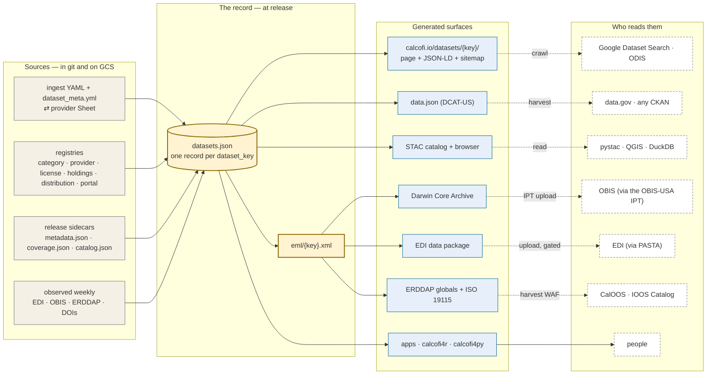

# Bringing the team along — the 9/8 update email, a 15-minute deck, and a docs page on metadata & the ingest loop

Status: **in progress 2026-09-07** (evening, Europe time). Updates the same evening: Ben set up
ImprovMX forwarding for `data@calcofi.io` → ben@oceanmetrics.io, esatterthwaite@ucsd.edu, bthuang@ucsd.edu
(email item 1 becomes a report, not a proposal; the UCSD Google Group stays as the long-term target). Two
sibling sessions are in flight and fold in when done: the calcofi.io landing re-cut (mockup
`claude.ai/code/artifact/7e41ff7c-2a0a-4bb7-b993-25142657dc77`, plan of 2026-09-07) and a **Contours lens**
for the Explorer — **live since 2026-09-07 17:51** (explore 165048a; `app.calcofi.io/contour` 308s to it), so slide 4 says
six lenses and slide 5 is the lens itself. The landing page's bento tile and the Explorer card in `products.yml`
(line 112) still say "One app, five lenses" — the landing session's to update. C and D started in this session (see § Measured at the end). Three deliverables for the CalCOFI data meeting
on **Tue 2026-09-08, 08:15–09:15 PT** (17:15 CEST; organizer Erin; Mark accepted, Betty has not answered
the invite). Nothing in this plan changes a product; it produces an email, a `.pptx`, one docs chapter and
one mermaid diagram. Ben sends the email and presents; the rest is generated and reviewed.

## The ask (Ben, 2026-09-07)

Two weeks of very fast building (Explorer, brand v2, the dataset catalog, the generic publishers, DOIs,
calcofi4py) met near-silence: on the "CalCOFI Explorer — one app, five lenses, no server" thread (5
messages, 8/29–9/2) only Erin replied — warm but brief ("wow that's quite an app … I want to spend a bit
more time with it") — and neither Mark nor Betty wrote back. The goal now is to **bring them along more
slowly**, in a **calm, even** register, with two artifacts:

1. **An email tonight**, asking for 20 minutes of tomorrow's hour to present and discuss, and flagging three
   near-term concerns: a real mailbox behind `data@calcofi.io`; whether any of the "not yet in the database"
   holdings on calcofi.io should be turned off publicly; and how the team interacts with the Google Sheets
   that now feed metadata and the ingest loop — that last one too long for an email, so it becomes a docs page.
2. **A 15-minute deck** (`.pptx`, imports cleanly into Google Slides) introducing everything that landed:
   the Explorer, the Datasets grid, the generic publishers as the realization of the *publish* box in the
   2022 architecture figure, the catalog diagram that improves on it, the DOI per release, calcofi4py and
   the helper functions, the feedback / register-a-product mechanism, and the asks. Closing note: software
   is no longer the bottleneck; human ideas and communication are.

## Context, measured 2026-09-07

### Where the audience is

- **Erin** is engaged and cautious. Her own emails in the fortnight were about *attribution before broad
  release* (9/2: source beside the variable, a citation per row, "Cite this data", a Sources page) and about
  *provider outreach through her own sheet* (9/4: "Once Betty and I finish cleaning this up … I will send it
  to the data providers"; she asked whether the CalOOS sheet can be the channel, Ben said "proceed with
  whatever is easiest"). She also proposed friendlier app names on 8/26 (Data Finder, Cruise Data Inventory …)
  and Mark asked on 8/27 how consistent the apps should be with the SIO site. All of those have answers now;
  the deck should show that *her* asks were built, not that ours were.
- **Mark** wrote once in the window (8/27, style consistency with SIO) and accepted tomorrow's invite. He
  reads for direction and risk, not features.
- **Betty** has been deep in the crab deposit with the UCSD Library (8/27–9/4) and the Station Explorer
  feedback round; she has not replied on the Explorer thread. Her interests are the ingest loop, the sheets
  and the crab questions to CDFW (Erin's 9/4 email to Christy Juhasz, answers by Sept 16).
- Ben's 9/2 reply to Erin quoted personal AI spend and a "$400K … 1000× ROI" comparison. **Keep that out of
  the deck.** The cost slide is about hosting; the closing slide is about how we work, said once, plainly.

### What is live (sources in brackets)

| Fact | Value | Source |
|---|---|---|
| Promoted release | **v2026.09.06** (2026-09-06): 16 datasets · 23 tables · 348,657,010 rows · 2.46 GB; 17 holdings; 25 reference objects | `datasets.json` `release`/`counts` |
| Release DOI · concept DOI | 10.5281/zenodo.22514953 · 10.5281/zenodo.22281994 | `catalog.json` `doi`/`concept_doi` |
| Release citation | "CalCOFI (2026). CalCOFI Integrated Database, release v2026.09.06 [Data set]. Scripps Institution of Oceanography, NOAA Fisheries, and California Department of Fish and Wildlife. https://doi.org/10.5281/zenodo.22514953" | `catalog.json` `citation` |
| Explorer response time | **155 ms** all-time average (153 ms 7-day) | `CalCOFI/uptime` README, pulled 2026-09-07 |
| Hexagon Explorer (db-viz-hex) response time | **11,324 ms** all-time (6,248 ms 7-day; 9,119 ms 30-day) | same |
| Other Shiny apps | Cruise 10,506 ms · CTD 11,009 ms · Contour 9,827 ms · Station (static) 177 ms | same |
| Monitors | 29 sites, all up; `status.calcofi.io` checks every 15 min | same |
| Explorer hosting | GitHub Pages + public GCS objects; no server; DuckDB-WASM in the browser | `explore/README.md` |
| Shiny/ERDDAP/PG server | one GCE VM (`shiny-server`, e2-standard-2 + 40 GB), the "≈ $200/mo" Ben cites — **confirm the figure in the GCP billing console before the slide is final** | `server/README.md` line 806 |
| Explorer lenses | **six**: stations · hexagons · **contours** (since 2026-09-07) · cruises · regions · sections; the Contour Explorer is retired (`app.calcofi.io/contour` → 308 → `explore/?lens=contour&var=temperature`, card `status: superseded`) | `explore/src/state.ts`, `curl -I`, `products.yml` |
| Contours lens, measured live 2026-09-07 | temperature, every site: **12,046 sites → 60,165 cells of 0.1° in 1.2 s**, leave-one-out RMSE 1.46 °C, blank beyond 60 km of a point and over land; station grid 0.3 s; kriging halves IDW's error (LOO 0.91 vs 1.72 °C on 213 station means) and the spline 0.83; eight surfaces (value · error · n · first/last year · p05/p95 · spread); ramps cmocean/viridis/GEBCO | the live fit line; contours plan § The take, D32, D40 |
| Feedback pipeline | *Help → Send feedback*: captures the view, annotate (arrow, circle, rectangle, pen, text), sends note + view URL + release + viewport + theme → Sheet `1_3DrB_MqrXEoyMtosTbbwgEHv-JXiEd0R1E2NeK9Pao` + mail (Ben, Erin, Betty, inline screenshot) + public issue in `CalCOFI/explore` (no email in the issue). *Register a product* is the second kind (`derived-product` label) | `explore/README.md` § Using it, § The feedback endpoint |
| Attribution in the Explorer | Sources line under the dataset pills · *Cite this data* (text/BibTeX) · `?modal=sources` Data Sources & Attribution (one row per dataset) · figure footers carry `Data: <dataset_key…>` · welcome button "I will cite the datasets I use" · every CSV carries `dataset_key` | CLAUDE.md § Attribution; `explore/README.md` § Attribution |
| Datasets grid | `calcofi.io/datasets/` (200): 12 categories in Biology ‖ Environment columns, alphabetical; holdings collapsed under "not yet in the database"; hover/tap cards on years bars and the station map | CalCOFI.github.io, memory 2026-09-06/07 |
| Dataset page | Explore · Get the data · Code (R ‖ Python) · Metadata records ‖ Archives & portals table with the archive-of-record **policy sentence** above it · Source files · coverage | same |
| Holdings | 17, all `visibility: public`, statuses `external` (10) / `archived` (7), none `planned`; every one already sits in a public archive (EDI, Stanford SDR, Zenodo, NCBI, CoastWatch ERDDAP, ifcb.caloos.org) | `datasets.json` `holdings`, `metadata/*/*/dataset_meta.yml` |
| Generic publishers | `publish_to-obis` (10 DwC-A staged at `gs://calcofi-db/publish/dwca/`), `publish_to-edi` (3 packages staged: bottle, ctd-cast, mets), `publish_to-erddap` (**45** datasets answered by `allDatasets` today), `publish_to-netcdf` (CF netCDF per dataset at `storage.calcofi.io/calcofi-files-public/netcdf/`); all idempotent since 9/6 (a re-run is a hash comparison) | `RELEASES.md` § Unreleased; `gcloud storage ls` |
| Ichthyo DwC-A parity vs the old IPT archive | data unchanged; two gaps to raise with SWFSC (depth asserted 0/NULL, biomass whole-mL) | artifact `d58f5c49-6e04-4cc3-b164-5479cb02cf57` |
| Machine surfaces | STAC `gs://calcofi-db/stac/catalog.json` (200) + browser `calcofi.io/stac/` (200) · `datasets.json` schema 1.1 · EML ×16 · ISO 19115 WAF via ERDDAP · DCAT-US `data.json` · JSON-LD per page · sitemap at `calcofi.io/datasets/sitemap.xml` (200; the root `/sitemap.xml` is 404 — say the right path on the slide) | curl 2026-09-07 |
| Packages | calcofi4r 1.22.0 · calcofi4py 0.9.0 (`cc_get_db`, `cc_query`, `qual_ok_sql`, CTD PostgreSQL helpers; `cc_interpolate()` / `interpolate()` since 1.21.0 / 0.8.0 reproduce the Contours surface cell for cell from a fixture the browser's own worker wrote) · calcofi4db 4.6.4 | NEWS/CHANGELOG, contours plan D39 |
| Provider Sheets | 7 (calcofi, swfsc, sio, cce-lter, cdfw, farallon, sccoos) in Shared Drive folder `1Tryjfd76TNU4nVPPSQiyQCy03uo0hlx6`; tabs: one per dataset (questions), `metadata` (long form, tiered required → recommended → optional), `holdings` (calcofi Sheet only, the triage board); service-account auth; `pull` writes only `answer/status/answered_date/who` and `value/edited_by/edited_date` | `metadata/questions_sheets.yml`, `scripts/sync_*_sheets.R` |
| `data@calcofi.io` | Already published as the contact in JSON-LD/DCAT (`_config.yml` `contact_email`), the "stay informed" mailto, and the EML fallback contact. DNS = Google Cloud DNS with **no MX record**: mail to it bounces today | `_config.yml`; catalog plan § Open questions 4 |

### The old figure and the new one

`docs/figs/sw_arch.svg` (Google Drawings, 2022) reads data → ingest → database → API → apps / reports →
**publish** → portals (ERDDAP, OBIS, DataOne/NCEI, InPort). The catalog artifact's SVG
(`claude.ai/code/artifact/5fe1fa4e-…`) is its successor: sources → **one record per dataset** →
generated surfaces → who reads them, with the caption Ben quoted. `docs/diagrams/portals_flow.mmd` is
already a v2 mermaid with the catalog node; it lacks the "surfaces" tier (STAC, DCAT, EML, DwC-A, EDI
package, ERDDAP globals) and the readers. This plan adds a v3 diagram used by both the docs and the deck.

## Deliverables

### A · The email (send tonight, PT evening)

To Erin, Mark, Betty (reply on the "CalCOFI data meeting" invite thread or a fresh subject; **not** on the
Explorer thread, whose tone we are stepping away from). Plain text, no images, under 250 words, one link
per item. Draft:

> **Subject:** 20 minutes tomorrow — CalCOFI.io update, and three small decisions
>
> Hi Erin, Mark and Betty,
>
> Could I have about 20 minutes of tomorrow's meeting? A lot landed on CalCOFI.io since we last met and I'd
> rather walk through it together than by email: the Explorer, the new Datasets catalog (one page per dataset
> with every endpoint), the generic publishers (OBIS, EDI, ERDDAP, netCDF), a DOI per database release, and
> the Python package for the CTD group. I'll bring a short deck and proposed next steps, and I'd like your
> reactions more than anything.
>
> Three things are time-sensitive and small:
>
> 1. **data@calcofi.io now works.** The address was already printed as the public contact in the catalog
>    and metadata we publish; as of today it forwards to the three of us. For the long term I'd like a
>    calcofi-data@ucsd.edu Google Group as its target — Erin, can you create one, or is that an ITS ticket?
> 2. **Holdings listed publicly.** calcofi.io/datasets/ now lists 17 datasets "not yet in the database"
>    (CCE-LTER EDI packages, NCOG genomics, the Stanford Hopkins records, cetacean sightings, IFCB, …). All are
>    already public archives, but if any should stay off the page until a provider conversation happens,
>    that is a one-word switch — tell me which.
> 3. **The Google Sheets.** Each provider now has one Sheet (questions, metadata, and for us a holdings
>    triage tab) that syncs with the versioned record. Erin, this overlaps with the attribution sheet you and
>    Betty are preparing; I'd like to agree tomorrow which one providers see, so nobody is asked twice.
>    How it all fits is written up here: calcofi.io/docs/metadata.html
>
> Cheers, Ben

If the docs page (C) is not live by send time, replace the last sentence with "I'll share a short page on
how it fits after the meeting" — never link a page that 404s.

### B · The deck (`presentations/2026-09-08_CalCOFI.io_update.pptx`)

**Shape.** 16:9, 16 slides, ~1 min each, brand v2 (UCSD navy `#182b49`, blue `#00629b`, yellow `#ffcd00`,
sand `#f5f0e6`; Source Sans 3 body, Teko display). Each slide: one headline sentence, one visual, ≤ 4 short
bullets, a footer with the URL shown. Speaker notes carry the talk track and the source of every number.
Title case off; declarative headlines.

**Fonts.** Google Slides has Source Sans 3 and Teko (Google Fonts), so the import keeps them; PowerPoint on
a machine without them falls back to Calibri, which is acceptable. Do not embed.

| # | Headline | Visual | Bullets / talk track |
|---|---|---|---|
| 1 | **CalCOFI.io — what landed since Aug 25, and what we need from each other** | lockup, release strip `v2026.09.06 · 16 datasets · 349 M rows · DOI` | date; "15 minutes, then discussion" |
| 2 | **Five things, one database** | tiles: the front door · Explorer · Datasets catalog · Publishers · Packages + DOI | the map of the talk; everything reads the same frozen release |
| 3 | **The front door: from ship to screen** | `presentations/assets/landing_hero_2026-09-07.png` (hero + the six numbers); `landing_top_2026-09-07.png` if a second beat is wanted (Where · When · release · ship's log · Explorer · get the data · taxa) | calcofi.io opens on a Line 90 section drawn to scale from the release and the brand's own sprite: the ship, the CTD wire with its 14 bottle depths to 515 m, the bongo at 210 m, PairoVET, manta, the CUFES intake, GEBCO sea floor, and 14 pins placed at the depth each measurement lives — every pin links to calcofi.org's method page, so calcofi.io never explains a net. The six numbers (77 years · 842 cruises · 49 ships · 218 stations · 2,614 taxa · 349 M rows) and the Where map (the real 218-cell grid) and When strip (measured coverage per dataset, the two asserted rows hatched) all come from the record, never typed. The ship's log writes itself: 77 entries from releases, datasets and apps, a hand-written file only for features, and a feed calcofi.org can pull. Deployed 2026-09-07 (CalCOFI.github.io PR #6); the landing session is still open for polish. |
| 4 | **One app, six lenses** | `images/explore_light.png` (or a fresh shot: `?lens=section&var=temperature&line=90&tour=off`) | we had five apps with slightly different grains; switching between them was confusing and every feature was built five times. Now one app, and the grains are lenses in one picker: stations, hexagons, contours, cruises, regions, sections. The URL *is* the view: send a link, get the exact map. Erin's 8/26 names still apply to the lenses. |
| 5 | **Contours: a surface between the stations, with its error, computed in your browser** | `presentations/assets/explore_contour_2026-09-07.png` (temperature, kriging over every site, the fit line visible in the panel) | the sixth lens, live today, replaces the Contour Explorer (which read the legacy PostgreSQL; its URL now redirects). Three methods — IDW for parity with the old app, ordinary kriging by default, a thin-plate spline — and the model-based two halve IDW's error *and* say where they are unsure: the error is a surface you can switch to. The fit line under the method says what you are looking at: 12,046 sites → 60,165 cells in 1.2 s, leave-one-out error 1.46 °C, blank beyond 60 km of a point. Eight surfaces from one table (the statistic, its error, observation density, first and last year, the 5th/95th percentiles and their spread); the inputs can be drawn on top; ramps follow oceanographic convention per variable. Honesty is built in: the sentence says *"by ordinary kriging"*, never just "temperature". And the same algorithm runs in R (`cc_interpolate()`) and Python (`interpolate()`), tested cell for cell against a fixture the browser wrote, so a figure is reproducible outside the app. No server. |
| 6 | **It answers in 0.15 s, and it costs nothing to host** | two response-time graphs from `uptime/graphs/{explore,db-viz-hex}/response-time-week.png` side by side, labelled 155 ms vs 11,324 ms | no server: the page is on GitHub, the tables on GCS, the SQL runs in the browser. The Shiny apps live on one VM (≈ $200/mo, confirm), one fewer since today: the Contour Explorer is retired. **The honest downside:** it is a large TypeScript app; maintaining it presumes AI-assisted development, and it needs a second pair of eyes — that is one of the asks. |
| 7 | **Attribution and feedback are built in** | crop of the Sources line + *Cite this data*, and the feedback dialog with an annotated screenshot (`explore/shots/live_feedback.png`) | Erin's five asks from 9/2 are all in: source beside the variable, a citation per row (`dataset_key` on every CSV), *Cite this data*, a Sources page, footers on figures. Feedback: screenshot → mark it up → goes to a Sheet, an email to the three of us, and a public GitHub issue; *Register a product* uses the same pipe. |
| 8 | **Every dataset has one page, and every page has every endpoint** | `images/datasets_light.png` (the grid) | we were stuck showing datasets *with credit* inside the apps, and nobody could find "the ERDDAP one" or "the netCDF one". Now: 16 in the database + 17 holdings, by category with the brand icons, generated from the release. |
| 9 | **A dataset page, top to bottom** | `images/dataset-ichthyo_light.png` (or a taller shot of `/datasets/swfsc_ichthyo/`) | Explore (which app opens on it) · Get the data · Code (R ‖ Python) · Metadata records (STAC, EML, JSON-LD) · Archives & portals with the *policy sentence* ("archive of record OBIS through the IPT; NCEI is SWFSC's; EDI does not apply") · Source files · coverage. |
| 10 | **The generic publishers work, and they wait for a decision, not a build** | small table: portal · what · how many · state | OBIS: 10 Darwin Core archives, staged; EDI: 3 packages (bottle, CTD, METS), staged; ERDDAP: 45 datasets live; netCDF: one per dataset. "Staged" = built and byte-stable, deposited only when we say so. The ichthyo archive matches the hand-built one that is on OBIS today, with two data questions for SWFSC. |
| 11 | **The 2022 picture, and what it became** | left: `docs/figs/sw_arch.svg` (rendered PNG); right: the new v3 mermaid (record → surfaces → readers) | the *publish* box is now real. What changed: everything a portal sees is generated from one record per dataset; the dotted boxes are catalogs run by others, each pointed at a static file we already publish. Old routes still there: OBIS, EDI, ERDDAP, NCEI. New: STAC, DCAT `data.json`, JSON-LD + sitemap (Google Dataset Search, ODIS), Zenodo. The only server-shaped option, pycsw, waits for a partner asking for CSW. |
| 12 | **Every release has a DOI** | screenshot of the Zenodo record + the RELEASES.html contents sidebar | citation string on the slide; concept DOI for "the database", version DOI per release; the changelog (`storage.calcofi.io/…/RELEASES.html`) says what changed and why, per release, with a table of contents. |
| 13 | **The same bytes from R, Python and the browser** | code pair: `calcofi4r::cc_get_db()` ‖ `calcofi4py.cc_get_db()` + the CTD team's `cc_pg_connect()` | calcofi4py 0.7.0 for the CTD group (release access + their PostgreSQL); calcofi4r 1.20.0; quality flags as one predicate in each language. No credentials in code. |
| 14 | **Providers edit a Sheet; git keeps the record; the release publishes it** | screenshot of one provider Sheet (metadata tab, tiered rows) + a 4-box flow: Sheet ⇄ `metadata/…/*.yml` + `questions.csv` → release → calcofi.io / EML / portals | one Sheet per provider, three kinds of tab; only the answer columns are editable; the weekly observer files a proposed question when a portal changes something. Point to the docs page. This is where the two-sheets question gets asked (slide 13). |
| 15 | **Decisions and asks, with an owner each** | table | see § Asks below — nine lines, no more |
| 16 | **Software is no longer the bottleneck** | plain, one line, navy band | said once, evenly: "Building is now fast. Deciding what to build, checking it, and telling people about it are what set the pace. That is where I need you." Then the proposed cadence (below). |
| A1 | Appendix: URLs | the list | every URL shown, for the PDF |

**Asks (slide 15), owner first.** Keep the register of "small, specific, dated":

| Ask | Owner | Proposed answer already on the table |
|---|---|---|
| Long-term target for `data@calcofi.io` (forwarding is live since 9/7) | Erin (Google Group `calcofi-data@ucsd.edu`, or one ITS ticket) | the public address never changes; the group becomes its target |
| Which holdings stay public | Erin, Mark | all 17 are public archives already; `visibility: internal` hides one from every public surface in one line |
| One outreach channel for providers | Erin, Ben | Erin's attribution sheet stays the outreach form for this round and is imported (`scripts/import_caloos_sheet.R`); from the next round the per-provider Sheets are the one place — or we add her columns to those Sheets now |
| Who holds the CalCOFI EDI account | Erin (recommended) | scope `edi`, one package per program dataset; CCE-LTER's stay in `knb-lter-cce` — ask Kathy/Mike once |
| OBIS: one IPT resource per bio dataset, and the contact per resource | Erin (contacts), Ben (upload) | 10 archives staged; existing OBIS records checked with their owners first |
| CalOOS ↔ our ERDDAP | Erin → Iwen Su | does CalOOS harvest `erddap.calcofi.io` directly; the CoastWatch handoff; propagation to data.ioos.us |
| Explorer review | Erin, Betty (by a date) | use the feedback button; 30 minutes each; Betty as second pair of eyes on the code |
| Crab answers from CDFW | Betty (Sept 16) | the ingest already ships examined-only; the remaining Qs are in the cdfw Sheet |
| calcofi.org ↔ calcofi.io links | Erin, Mark, with the SIO web team | the hero's pins already link out to calcofi.org's method pages; a link back from calcofi.org/data's tiles to `calcofi.io/datasets/{key}/` closes the loop (cosmetic, whenever the web team has a slot) |

**Proposed cadence (slide 16, one line):** a monthly release (already the rhythm since August), a 20-minute
demo in the data meeting when something ships, and questions to providers only through the Sheets.

**Build mechanics.**

- Script `presentations/build_update_2026-09-08.R` beside the existing `build_deck.R` (officer 0.7.6,
  flextable 0.10.0, rsvg 2.7.0 all installed; magick and rvg are not, and are not needed).
  `read_pptx()`'s default template is **4:3** — make `presentations/assets/template_16x9.pptx` once
  (PowerPoint or LibreOffice: blank, 13.333 × 7.5 in, Office Theme layouts) and `read_pptx(template)`.
  Fonts via `fp_text(font.family = "Source Sans 3")` / `"Teko"`; colours from brand v2. Speaker notes with
  `set_notes()`.
- Logo: `rsvg::rsvg_png("../CalCOFI.github.io/brand/v2/logo_calcofi_h.svg", …)`.
- Screenshots: reuse the site's own card shots in `CalCOFI.github.io/images/*_light.png` (explore, datasets,
  dataset-ichthyo, dataset-ctd-cast, db-viz-hex, erddap, storage, calcofi4py, workflows, docs) — they are
  current as of 9/7 and brand-checked. For anything taller or cropped use `shot-scraper --selector` (the
  Chrome MCP paints only a top band on this site) and, for the Explorer, `node scripts/verify.mjs` in
  `../explore` (the MCP tab never paints WebGL). Add `&tour=off&theme=light` to every Explorer URL.
- Uptime graphs: `../uptime/graphs/{explore,db-viz-hex}/response-time-week.png` (pull the repo first).
- Diagram: `mmdc -i docs/diagrams/catalog_flow.mmd -o presentations/assets/catalog_flow.png -w 2400 -b transparent`
  (`mmdc` is installed); the 2022 SVG via `rsvg_png`.
- Google Slides check: upload the `.pptx` to the CalCOFI Drive folder, open, and look at slides 3–6, 11, 14
  (images), 10 and 15 (tables) — flextable renders as a native table and imports cleanly.

### C · The docs chapter: `docs/metadata.qmd` — "Metadata & the ingest loop"

Placed after `db.qmd` in `_quarto.yml`'s chapter list (db → metadata → data-access). Written for Erin,
Betty and a data provider, not for an engineer; ~900 words plus two figures; it links out to CLAUDE.md-level
detail rather than repeating it. Outline:

1. **What a dataset is here.** One `dataset_key` (`provider_dataset`), one record, one page. The three states:
   holding (`planned | external | archived`), in the pipeline (`in_release: false`), released. The same key,
   sidecar and Sheet row through all three, so the page URL never changes.
2. **Where the words live.** `metadata/{provider}/{dataset}/dataset_meta.yml` holds the descriptive half
   (abstract, methods, creators, contact, licence, DOI, acknowledgement, `visibility`); the notebook YAML holds
   the structural half; coverage, counts and `source_accessed` are **measured at release, never typed**.
   A short table of the required → recommended → optional tiers from `dataset_meta_fields.csv`.
3. **The Sheets, and what you may edit.** One Sheet per provider in the Shared Drive folder; three tab kinds:
   a tab per dataset (questions: edit `answer`, `status`, `answered_date`, `who`), `metadata` (edit `value`;
   `edited_by`/`edited_date` stamp themselves), and on the CalCOFI Sheet `holdings` (the team's triage board:
   `status`, `priority`, `owner`, `next_step`). Everything else is protected on purpose. `visibility` is a
   checkbox: `internal` keeps a dataset in the record and off every public surface.
4. **The question registry.** `open | proposed | answered | wontfix`; what *proposed* means (we already have
   an answer and want it confirmed); how a question reaches a provider (the Sheet, the email draft) and how
   the answer comes back (`pull`, validated, one commit).
5. **What happens after you edit.** The sync (`push`/`pull`, dry-run by default, service-account auth), the
   monthly release, and the surfaces regenerated from the record: the dataset page, `datasets.json`, EML,
   STAC, DCAT, the DwC-A / EDI package / ERDDAP globals. The weekly observer (`observe_distributions()`)
   files a *proposed* question when a portal's record drifts. Figure: the v3 diagram (shared with the deck).
6. **A new dataset, end to end.** The skills loop in one paragraph (`/explore-dataset` → `/generate-metadata`
   → `/ingest-new` → run → `/validate-ingest` → release), with the human hand-offs named.
7. **Who to contact.** `data@calcofi.io`, the feedback button, GitHub issues per repo.

Verification for C: `quarto render` in `../docs` passes; the chapter appears in the sidebar; every link
answers 200; `check_brand.py` is unaffected (no head/theme change).

### D · The diagram: `docs/diagrams/catalog_flow.mmd` (v3)

Replaces `fig-portals-flow` in `portals.qmd` and joins `index.qmd` beside the 2022 figure (which stays, as
history). Brand-neutral fills (the docs render both themes); classes per tier; every reader box dashed.
Draft:

Caption (Ben's, kept verbatim): *Everything a portal sees is generated from one record per dataset. The
dotted boxes are catalogs run by others; each is pointed at a static file we already publish. The one
server-shaped option, pycsw, is gated on a partner asking for CSW.*

## Decisions taken in this plan (Ben to confirm or flip)

1. **The email goes on a fresh subject, not the Explorer thread.** The thread's register was exuberant; the
   meeting's is collegial. Fresh subject, plain text, three numbered items, one link each.
2. **Cost is hosting cost.** The deck compares a VM to static hosting and says nothing about AI subscriptions
   or notional consultancy prices.
3. **The downside is stated on the same slide as the upside** (slide 6), and it becomes an ask (a reviewer),
   not an apology.
4. **The closing line is one sentence, no "singularity".** The idea is Ben's and it is right; the word reads
   as hype to this audience. "Software is no longer the bottleneck" carries it.
5. **Erin's outreach sheet is respected, not replaced this round.** Slide 13 asks which sheet providers see;
   the recommendation is import now, per-provider Sheets from the next round. Ben already said "proceed with
   whatever is easiest" on 9/4; do not reverse that by email.
6. **Holdings stay public unless someone names one.** Every holding is already a public archive record; the
   switch exists (`visibility: internal`) and is offered, not applied.
7. **The docs page is the long version; the deck slide is the short one.** Neither repeats CLAUDE.md.
8. **Reuse the site's card screenshots.** They are current, brand-checked, and in both themes; shoot fresh
   only where a crop is needed (Sources line, feedback dialog, Sheet tab, Zenodo record).

## Execution (order matters: the email links the page)

| Step | What | Who / model | Time |
|---|---|---|---|
| 0 | Confirm the VM monthly cost (GCP billing) and the CalOOS sheet id Erin linked (`1eyvhdzA5YwuDxH8tBld2-h_odKA1KYt_RXI3loI0OaU`) is the one `import_caloos_sheet.R` reads | Ben | 5 min |
| 1 | Write `docs/diagrams/catalog_flow.mmd`; render with `mmdc` to check it; wire into `portals.qmd` (replace `fig-portals-flow`) and `index.qmd` (beside the 2022 figure) | Sonnet · high | 30 min |
| 2 | Write `docs/metadata.qmd` per § C; add to `_quarto.yml`; render; push (the book deploys itself) | Sonnet · high | 1.5 h |
| 4 | Send the email (§ A) with the live link — or the fallback sentence | Ben | 5 min |
| 6 | `presentations/assets/template_16x9.pptx`; `build_update_2026-09-08.R`; assets (logo PNG, uptime graphs, diagram PNG, the four fresh crops); build; open in PowerPoint | Opus · medium | 2.5 h |
| 7 | Upload to Drive, open in Google Slides, fix anything that moved; export PDF beside the pptx | Ben | 20 min |
| 8 | Dry run against a clock: 14 slides in 13 minutes, notes only | Ben | 15 min |

Total about five hours; steps 1–2 and 4 can run in parallel (two sessions, two worktrees are not needed —
different repos).

## Verification

- Email: every link answers 200 in a private window; the three numbered items each end in a proposal.
- Deck: opens in PowerPoint without a repair prompt; slide size 13.333 × 7.5 in; every number on a slide
  appears in the table above with its source in the notes; fonts named Source Sans 3 / Teko in the XML
  (`unzip -p … ppt/slides/slide4.xml | grep -o 'typeface="[^"]*"' | sort -u`); the Google Slides import shows
  images on 3–9, 11–14 and tables on 10 and 15; PDF exported.
- Docs: `quarto render` clean; sidebar shows the new chapter; `curl -s -o /dev/null -w '%{http_code}'` on
  every link in it; the diagram renders client-side (mermaid-format png stays off).
- Sitemap: the slide and the docs say `calcofi.io/datasets/sitemap.xml`, which is the path that answers.

## Risks and what bounds them

- **Over-length.** The deck is capped at 16 slides + appendix, ≤ 4 bullets each, by construction; the dry
  run is the check. If it runs long, drop slides 12 and 13 into the appendix — the DOI and packages survive as
  one line on slide 2.
- **Tone drift.** Every headline is a declarative sentence about a thing that exists; no exclamation marks;
  the one "we did it" moment is slide 10 and it ends in "waits for a decision". Ben reads the notes aloud once
  before the meeting.
- **The two-sheets problem lands badly.** It is framed as *our* duplication to resolve, with Erin's channel
  kept for this round. If Erin prefers her sheet permanently, `import_caloos_sheet.R` already exists; the
  per-provider `metadata` tabs become read-only mirrors and nothing is lost.
- **Numbers go stale between now and 08:15 PT.** The uptime README is regenerated hourly; pull it once more in
  the morning and rebuild (the build is a script), or leave the graphs as "as of 2026-09-07".
- **A screenshot shows the dark theme or the tour.** Every URL in the build carries `theme=light&tour=off`;
  the card shots are the `_light` files.
- **Google Slides drops a font or a table style.** Checked in step 5; a fallback to Calibri is acceptable and
  flextable tables import as native tables.

## Kickoff prompts

Two sessions, in parallel; each cwd `~/Github/CalCOFI/workflows` so CLAUDE.md and the memory index load.

**Docs + diagram (Sonnet · high):**

> Read `.claude/plans/2026-09-07 Bringing the team along ….md` §§ C and D. In `../docs`, add
> `diagrams/catalog_flow.mmd` from § D (render it once with `mmdc` to catch syntax), replace `fig-portals-flow`
> in `portals.qmd` with it and add it to `index.qmd` beside the 2022 figure (keep that figure). Write
> `metadata.qmd` per § C — for Erin, Betty and a provider, ~900 words, no CLAUDE.md internals — and add it after
> `db.qmd` in `_quarto.yml`. Render, check every link answers 200, commit and push. Report the live URL.

**Deck (Opus · medium):**

> Read `.claude/plans/2026-09-07 Bringing the team along ….md` § B and the facts table in § Context. Create
> `presentations/assets/template_16x9.pptx` (LibreOffice headless from a blank 16:9 `.odp` is fine), then
> `presentations/build_update_2026-09-08.R` with officer + flextable mirroring `build_deck.R`'s helpers but in
> brand v2 (colours, Source Sans 3 / Teko). Assets: logo via rsvg from `../CalCOFI.github.io/brand/v2/logo_calcofi_h.svg`;
> `git -C ../uptime pull` then the two response-time-week PNGs; the site's `images/*_light.png` card shots; the landing crops already in `presentations/assets/landing_*_2026-09-07.png` (re-shoot with `shot-scraper 'https://calcofi.io/?theme=light&tour=off' --width 1440` if the landing session ships more);
> `mmdc` on `../docs/diagrams/catalog_flow.mmd` (write it from § D if the docs session has not yet); fresh crops
> with `shot-scraper --selector` for the Sources line, the feedback dialog (`../explore/shots/live_feedback.png`
> exists), one provider Sheet's metadata tab, and the Zenodo record. Speaker notes on every slide carry the
> talk track and each number's source. Build, open with `open`, then run the XML font check from § Verification.
> Do not invent a number: anything not in the facts table is a placeholder in square brackets for Ben.

## Measured (appended as pieces ship)

- **2026-09-07 · D done.** `docs/diagrams/catalog_flow.mmd` (record → surfaces → readers, brand-neutral fills,
  dashed readers) renders with `mmdc` and client-side in the book; it replaces `portals_flow.mmd` in
  `portals.qmd` (paragraph before it rewritten from "one possible realization" to the flow as it runs) and
  joins `index.qmd` beside the 2022 figure, which stays as history. PNG for the deck:
  `mmdc -i ../docs/diagrams/catalog_flow.mmd -o presentations/assets/catalog_flow.png -w 2400 -b white`.
- **2026-09-07 · C done.** `docs/metadata.qmd` "Metadata & the ingest loop" (chapter 6, after Database):
  one key/record/page with the three states; authored vs measured; the tier table read live from
  `metadata/dataset_meta_fields.csv` (gt, `fmt_markdown` on guidance); the Sheets table (three tab kinds,
  editable columns); `visibility` and `license` notes; question statuses and what *proposed* means; what a
  sync and a release regenerate (the diagram); the weekly observer; the five-step loop; who to contact
  (`data@calcofi.io` now forwards). Rendered locally to `_book/`, every link 200 (ranged GET), screenshots
  checked. Docs commits a46d6f7 + ca3b61c pushed to `CalCOFI/docs` main (the first carried only `metadata.qmd`
  and the diagram deletion — a failed `git add` pathspec — the second carries the wiring; the book
  deploys itself through `render_book.yml`, ~15 min on the macOS runner). Live URL once deployed:
  https://calcofi.io/docs/metadata.html. Side fix pushed to `CalCOFI/workflows` (c18a687): the
  `citation_main` guidance cell no longer carries escaped quotes.
- Email item 3 can now link the live page; the deck's slide 14 footer is the same URL.
- **2026-09-07 · the docs deploy was already red before this work.** This morning's portals commit (70341e2)
  failed `render_book.yml` at the **docx** download: gt 1.3.0's Word export unescapes `&` in a
  `fmt_markdown()` cell and then parses the cell as XML (`xmlParseEntityRef: no name`), and v2026.09.06's
  record carries "Picoplankton & Bacteria". A local `quarto render --to html` cannot show it; the check is
  `gt::as_word(tbl)` on the chunk's table (plus `as_latex()`). Fixed in 3473672: both live portals tables
  link each dataset with `fmt_url(label = from_column("name"))`, which passes Word, LaTeX and HTML;
  `tbl-meta-fields` was already clean. Runs a46d6f7 and ca3b61c failed for the same pre-existing reason;
  3473672 is the deploy to watch.
- **2026-09-07 · LIVE.** The pdf download failed next (gt's `fmt_url()` writes the raw URL into LaTeX with
  an unescaped `_`): 2bab28d makes the dataset link HTML-only (`knitr::is_html_output()`; the pdf/docx/epub
  show the plain name). Deploy run 34137348470 green; https://calcofi.io/docs/metadata.html answers 200,
  chapter 6 in the sidebar, the diagram in Process, Portals and Metadata. Email item 3 links it as written.
- **2026-09-07 · the Sheets, verified against Google (Ben's question).** All seven provider Sheets exist in the
  Shared Drive folder *questions* (`1Tryjfd76…`), each titled "CalCOFI integrated database — questions for
  <provider>", each with README + one tab per dataset + a populated `metadata` tab (rows: calcofi 225, swfsc 97,
  sio 97, cce-lter 353, cdfw 33, farallon 33, sccoos 65), and the CalCOFI Sheet a `holdings` tab (18 rows);
  pushed 2026-09-05 09:15, no human edit since (Drive `modifiedTime`). `docs/metadata.qmd` now names the title
  and the folder so the reader is not misled (b2440d2). Two things fell out of the read-only pull:
  - `gs_pull_holdings()` crashed on every holding (`readLines(NULL)`: `dm_all_holding_sidecars()` never
    stamped `path`) — fixed with a regression test, workflows 7653ede; the pull now completes.
  - **The holdings tab's `priority` column holds the CalOOS portal priorities** (EDI / Other / NCBI /
    CalOOS / ERDDAP / "CalCOFI website") for 15 of 17 holdings, while the sidecars carry those under
    `priority_caloos` and leave `priority` (the team's triage priority) blank. **Root cause (found by
    the regression test, not the hypothesis above): R's `$` partial-matches list names**, so
    `sidecar_list$priority` returned `priority_caloos` whenever `priority` was absent. **Resolved
    2026-09-07 evening (Ben: "re-push and fix however necessary")**: `dm_holdings_row()` indexes with exact
    `[[`, the tab gains a read-only `priority_caloos` column beside `priority`, a re-push now deletes the
    tab's existing protected ranges before re-protecting (they protect by column index, so the inserted
    column would have left `next_step` under a stale range), tests for each; `push calcofi --execute` run:
    metadata tab 224 rows, holdings 17 rows, `priority` blank on all, `priority_caloos` on 15, five clean
    protected ranges, and a dry-run pull reports **0** diffs. `pull --execute` is safe again.
- The plan file itself was committed by the landing-page session under a nested path (its title had a
  slash); renamed in git to the on-disk name, c712511.
- **2026-09-07 · the landing page is a slide (Ben).** The re-cut is deployed (plan `2026-09-07 CalCOFI.io landing
  re-cut …`, L1–L5 measured, the Where map static after Ben's note); slide 3 shows it, with two crops of the live
  page saved to `presentations/assets/landing_{hero,top}_2026-09-07.png` (1440 wide, light, tour off). One
  inconsistency to hand the landing session: the numbers band says **349 M** rows and the catalog strip below it
  **348 M** for the same 348,657,010 (rounding vs truncation) — one should give.
- **2026-09-07 · Contours is a slide (Ben).** The lens shipped and deployed the same evening (contours plan
  `2026-09-07 Explorer Contours lens …`, all slices; explore 165048a, Pages green 17:51; `app.calcofi.io/contour`
  308 → the lens; calcofi4r 1.22.0 / calcofi4py 0.9.0 carry the parity functions). Slide 4 now says six lenses,
  slide 5 is the lens, the live shot is `presentations/assets/explore_contour_2026-09-07.png` (1440 × 900, light,
  headless Chromium — the Chrome MCP tab freezes on the surface's BitmapLayer, so never shoot this one there).
  Two lines for the landing session: the bento tile "One app, 5 lenses" and `products.yml` line 112 "One app,
  five lenses — stations, hexagons, cruises, regions and sections" should say six and name contours.
- **2026-09-07 · B built.** `presentations/2026-09-08_CalCOFI.io_update.pptx` (17 slides = 16 + the URL appendix,
  13.333 × 7.5 in, 3.7 MB) from `presentations/build_update_2026-09-08.R` (officer 0.7.6 + flextable 0.10.0), on
  `presentations/assets/template_16x9.pptx` — officer's own 4:3 template with `sldSz` widened and every
  layout/master placeholder rescaled ×4/3, so the "Office Theme" layouts survive. Brand v2 throughout (navy /
  blue / yellow / sand, Source Sans 3 body, Teko headlines, Source Code Pro for the two snippets); the XML names
  only those three faces (`grep typeface` over all 17 slides). Speaker notes on every slide carry the talk track
  and each number's source. **Numbers are read at build time, not typed**: release facts from
  `data/releases/v2026.09.06/{datasets.json,catalog.json}`; response times from `../uptime/api/*/response-time*.json`
  (147 ms Explorer / 11,353 ms Hexagon Explorer all-time at the 2026-09-07 pull — the facts table's 155 / 11,324
  had already moved; 28 monitors, not 29: `oceano` was deleted in that pull); package versions from the sibling
  repos; the ERDDAP count live from `allDatasets` (44 excluding the `allDatasets` row; the facts table's 45 counted
  it) with a fallback; holdings statuses from `holdings[].status.stage`. The one placeholder on a slide is the VM
  cost, `[about $200/mo — confirm in the GCP billing console]` (slide 6 + its note). Assets shot tonight:
  Zenodo record (shot-scraper needed `--timeout 150000`; the first try captured Zenodo's own 504 page — check the
  PNG, not the exit code; cookie banner cropped in the script), `RELEASES.html`, the Explorer's
  `?modal=sources` crop (`--selector .modal-sources`; the `.sources` line itself sits in a collapsed *More options*
  and shot-scraper cannot see it), the CalCOFI Sheet's `metadata` tab via the logged-in Chrome tab (shot-scraper
  has no Google session), the 2022 SVG and both lockups via rsvg, the v3 diagram via `mmdc -b white`. Two officer
  traps, both now handled in the script: `read_pptx()` has no 16:9 template (hence the widened copy), and every
  `ph_location()` shape is a *placeholder*, so an empty rectangle shows "Click to edit Master text styles" in
  PowerPoint's edit view, LibreOffice and Google Slides — `strip_ph()` removes the `<p:ph>` tags after `print()`
  (each shape keeps its own `<a:xfrm>` and run properties). Reviewed slide by slide through LibreOffice → PDF →
  PNG, i.e. in *fallback* fonts (Source Sans 3 / Teko are not installed here — `fc-list` is empty; the brand
  ships woff2 only), which are wider than the real faces, so what fits there fits in the brand fonts. Left for Ben:
  step 0 (the VM cost), step 7 (Drive upload → Google Slides check on 3–9, 11–14 images and 10, 15 tables →
  PDF export; the LibreOffice PDF was not kept because it carries the fallback fonts), and the morning
  `git -C ../uptime pull` + rebuild if the response-time numbers should be fresh.
