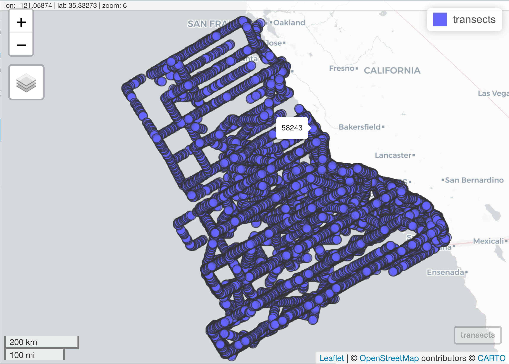

```{r setup, include=FALSE}
knitr::opts_chunk$set(echo = TRUE, warning = F, message = F)
```

## Packages & setup
```{r}
# packages
if (!require("librarian")){
  install.packages("librarian")
  library(librarian)
}
librarian::shelf(
  dplyr, DT, dygraphs, glue,googlesheets4, gstat, here, lubridate, mapview, purrr, readr, 
  raster, rmapshaper, sf, skimr, stars, stringr, tidyr)
select <- dplyr::select
mapviewOptions(fgb = FALSE)

# paths
dir_data <- switch(
  Sys.info()["nodename"],
  `Bens-MacBook-Pro.local` = "/Users/bbest/My Drive/projects/calcofi/data",
  `Cristinas-MacBook-Pro.local` = "/Volumes/GoogleDrive/.shortcut-targets-by-id/13pWB5x59WSBR0mr9jJjkx7rri9hlUsMv/calcofi/data",
  `Bens-MacBook-Air.local` = "/Volumes/GoogleDrive/My Drive/projects/calcofi/data")
  # TODO: get Erin's Google Drive path and "nodename")
```

## Read [Bird Mammal Census](https://oceaninformatics.ucsd.edu/datazoo/catalogs/ccelter/datasets/255) datasets from gdrive

```{r}
# bird & mammal counts from CalCOFI cruises
bird_mamm_csv <- file.path(dir_data, "/whales-seabirds-turtles/bird-mammal-census/CalCOFI_bird-mammal-census_observations.csv")
# log of transect datetimes & locations from CalCOFI cruises
transects_csv <- file.path(dir_data, "/whales-seabirds-turtles/bird-mammal-census/CalCOFI_bird-mammal-census_transects.csv")
# behavior codes
codes_bird_mamm_beh_csv <- file.path(dir_data, "/whales-seabirds-turtles/bird-mammal-census/CalCOFI_bird-mammal-census_behaviorcodes.csv")
# species codes
codes_bird_mamm_sp_csv <- file.path(dir_data, "/whales-seabirds-turtles/bird-mammal-census/CalCOFI_bird-mammal-census_allspecieslist.csv")

d_bird_mamm <- read_csv(bird_mamm_csv, guess_max = 1000000)
d_transects <- read_csv(transects_csv, guess_max = 1000000)
codes_bird_mamm_beh <- read_csv(codes_bird_mamm_beh_csv) 
codes_bird_mamm_sp  <- read_csv(codes_bird_mamm_sp_csv) 

# d_bottle <- read_csv(bottle_csv, skip=1, col_names = F, guess_max = 1000000)
# names(d_bottle) <- str_split(
#   readLines(bottle_csv, n=1), ",")[[1]] %>% 
#   str_replace("\xb5", "µ")
# 
# names(d_transects) <- stringi::stri_encode("", "UTF-8") %>% 
#   tolower(names(d_transects)) %>% 
#   str_replace(" " = "_")

# transform transect lat/lon values to pts
# pt_transects <- d_transects %>% 
#   sf::st_as_sf(coords = c("Longitude Mid (º)", "Latitude Mid (º)"))
```

## Filter by AOI and plot over time or by group (bar plot)

### Get aoi

```{r}
# get example AOI (Channel Islands NMS)
sanctuaries_geo <- "https://github.com/noaa-onms/onmsR/raw/12a87dfd4b90f2e3009ccb4913315fb2df7afddc/data-raw/sanctuaries.geojson"

cinms_ply <- sf::st_read(sanctuaries_geo) %>%
  dplyr::filter(nms == "CINMS")

# get AOI geom points as WKT for later use with API
cinms_txt <- sf::st_as_text(cinms_ply$geometry)

# get aoi
aoi = cinms_ply
```

```{r}
# GET TRANSECTS AS POINTS
transects <- d_transects %>% 
  sf::st_as_sf(coords = c("Longitude Mid (º)", "Latitude Mid (º)"), crs = 4326) %>% 
  distinct()

# [ ] TODO: make TRANSECT LINES from Lat/Lon Start and Stop

get_linestring <- function(d){
  start    <- tibble(lon = d$lon_start, lat = d$lat_start)
  stop     <- tibble(lon = d$lon_stop,  lat = d$lat_stop)
  lines_sf <- vector("list", nrow(d))
  for (i in seq_along(lines_sf)) {
    lines_sf[[i]] <- st_linestring(as.matrix(rbind(start[i,], stop[i,])))
  }
  st_sfc(lines_sf, crs = "+proj=longlat +datum=WGS84")
}

transect_sfc <- d_transects %>% 
  drop_na() %>% 
  group_by(`Transect number`) %>% 
  summarize(
    lat_start = mean(`Latitude Start (º)`),
    lon_start = mean(`Longitude Start (º)`),
    lat_stop  = mean(`Latitude Stop (º)`),
    lon_stop  = mean(`Longitude Stop (º)`),
    lat_mid   = mean(`Latitude Mid (º)`),
    lon_mid   = mean(`Longitude Mid (º)`)) %>% 
  get_linestring()
# map of all transects
mapview(transect_sfc)

# map of all transects within example AOI
transect_sf <- st_sfc(transect_sfc)
tibble(transect_sf) %>% 
  mutate(
    x = st_intersects(transect_sf, aoi) %>% as.logical()) %>% 
  filter(x) %>% 
  pull(transect_sf) %>% 
  mapview(color = "yellow", add=T)
```


```{r}
bird_mamm_census <- d_bird_mamm %>% 
  left_join(
    d_transects, 
    by = "GIS key") %>% 
  left_join(
    codes_bird_mamm_beh %>% 
      select(Behavior, Behavior_Description = Description), 
    by = "Behavior") %>%
  left_join(
    codes_bird_mamm_sp %>% 
      mutate(across(
        c("Bird", "LargeBird", "Fish", "Mammal", "Include", "Unidentified"), 
        as.logical)), 
    by = "Species")
 

# mapview(transects) # NOTE: this is prohibitively large to render to html (> 100 MB html)
```



```{r}
pts <- transects
pts %>% mutate(x = st_intersects(pts, aoi))
 
# find transects within aoi
pts_aoi <- pts %>% 
  mutate(
    x = st_intersects(pts, aoi) %>% as.logical()) %>% 
  filter(x) %>% mapview()

mapview(pts_aoi, color = "yellow", add=T)

# test summary
bird_mamm_summ <- bird_mamm_census %>% 
  filter(`GIS key` %in% pts_aoi$`GIS key`) %>% 
  filter(Season %in% c("Spring", "Summer", "Fall", "Winter")) %>% 
  group_by(Season) %>% 
  summarize(n_Species = n_distinct(Species))

library(plotly)
plot_ly(
  bird_mamm_summ, 
  x = ~Season, y = ~n_Species, type = "bar", 
  title = "Number of unique species per season")
```

## Next Steps

- After selecting transects for AOI, show me the presence of a species observed over time?
  - What times was there observation? How much
  - How many observations of the species?
  - Sightings per unit effort (SPUE)
    - What's a "unit of effort"? Perhaps a transect, or better yet length of transect, eg 10 km or unit time of observation.

See Santora, J. A., and W. J. Sydeman. 2015. [Persistence of hotspots and variability of seabird species richness and abundance in the southern California Current](http://dx.doi.org/10.1890/ES14-00434.1). Ecosphere 6(11):214:

> Integrating seabirdobservations with station data requires a grid-based approach to resolve spatially explicit timeseries that account for survey effort over time. Allshipboard tracklines, indexed by 3 km intervals(Yen et al. 2006; Fig. 1), was linked to a GIS, as wehave done for other studies in the CCE (Santoraet al. 2011a, b, 2012a, b). The extent of theshipboard trackline (total survey effort) andCalCOFI sampling stations determined the ex-tent and size of grid cells. This was accomplishedusing the create fishnet command in ArcView toproject the individual 3km sampling points ontoa grid with cells size of 0.78 3 0.78 (;4500 km2).The size of cells was chosen to account for totaltrackline effort (Fig. 1) and to reflect the layout ofthe CalCOFI hydrographic and biological sam-pling stations (Fig. 1) in order to permit futureintegration with those data sets. The grid processresolved the location of consistently sampledcells during 1987–2012 with 45 and 48 cells inspring and summer, respectively (Fig. 1). 
> 
> (17) (PDF) Persistence of hotspots and variability of seabird species richness and abundance in the southern California Current. Available from: https://www.researchgate.net/publication/283799672_Persistence_of_hotspots_and_variability_of_seabird_species_richness_and_abundance_in_the_southern_California_Current [accessed Mar 31 2022].
>
> We standardized sampling effort by assessingthe number of times the ship visited a cell and theamount of survey effort collected within that cell,relative to all cells in a given season over theentire length of the time series (Santora and Veit2013). To determine a threshold to use as a cutoff, we calculated the mean 6 SD of cell visitsand effort per season, then omitted all effort lessthan 1 SD below the mean. 
>
> (17) (PDF) Persistence of hotspots and variability of seabird species richness and abundance in the southern California Current. Available from: https://www.researchgate.net/publication/283799672_Persistence_of_hotspots_and_variability_of_seabird_species_richness_and_abundance_in_the_southern_California_Current [accessed Mar 31 2022].

## OLD...

```{r, eval=F}
pts <- stations
pts_aoi <- pts %>% 
  mutate(x = st_intersects(pts, aoi) %>% as.logical()) %>% 
  filter(x)


test_data <- bird_mamm_census %>% 
  
```


### Filter by aoi

```{r, eval=F}
# choices for `date_step`: "day", "week", month", "quarter", "year", "decade"
# get_oceano_var_aoi <- function(
#   var, aoi, 
#   date_step = c("year", "day", "week", "month", "quarter", "decade"), 
#   depth_min = 0, depth_max = 10){
  
  # test values
  # var = "Bottle O2 (ml_L)"; aoi = cinms_ply; date_step = "year"; depth_min = 0; depth_max = 4000
  # var = "Salnty"; aoi = cinms_ply; date_step = "year"; depth_min = 0; depth_max = 1000

  
  d <- bird_mamm_census
  
  locations <- bird_mamm_census %>% 
    select()


  pts <- stations
  
  # find stations in aoi
  pts_aoi <- pts %>% 
    mutate(
      x = st_intersects(pts, aoi) %>% as.logical()) %>% 
    filter(x)

  d_summ_1 <- d %>% 
    st_in
    
    
  
  
  
  
  d_summ     <- d %>% filter(!is.na(.data[[var]]))
  d_aoi_summ <- d_summ %>% filter(Sta_ID %in% pts_aoi$Sta_ID)

  # d_test <- d %>% filter(!is.na(`Bottle O2(ml_L)`))
  # d_test_aoi <- d_test %>% filter(Sta_ID %in% pts_aoi$Sta_ID)
  
  # d_aoi_summ <- d_aoi %>% 
  #   filter(!is.na(.data[[var]]))
  
  empty_data_for_var <- ifelse(nrow(d_aoi_summ) == 0, TRUE, FALSE)
  
  if (empty_data_for_var) {
    d_aoi_summ <- d_summ
  }
  if (any(!is.na(.data[[Depthm]]))) {
    d_aoi_summ <- d_aoi_summ %>% 
      filter(Depthm >= depth_min, Depthm < depth_max)
  }
  d_aoi_summ <- d_aoi_summ %>% 
    mutate(Date_Step = update_date(Date, unit = date_step)) %>% 
    group_by(Date_Step) %>% 
    summarize(
      var_n   = n(),
      var_min = min(.data[[var]], na.rm = T),
      var_q10 = quantile(.data[[var]], probs = 0.10, na.rm = T),
      var_avg = mean(.data[[var]], na.rm = T),
      var_q90 = quantile(.data[[var]], 0.90, na.rm = T),
      var_max = max(.data[[var]], na.rm = T),
      var_sd  = sd(.data[[var]], na.rm = T)) %>% 
    rename(Date = Date_Step)

  attr(d_aoi_summ, "labels")    <- eval(parse(text = glue("var_lookup$`{var}`")))
  attr(d_aoi_summ, "date_step") <- date_step
  attr(d_aoi_summ, "date_msg")  <- glue("This dataset was summarized by {date_step}.")
  attr(d_aoi_summ, "aoi") <- ifelse(
    empty_data_for_var, 
    glue("No data were found for {var} in this area of interest. Summaries were conducted across all existing data points."),
    glue("Data for {var} in selected area of interest")
  )
  
  d_aoi_summ
}
```


