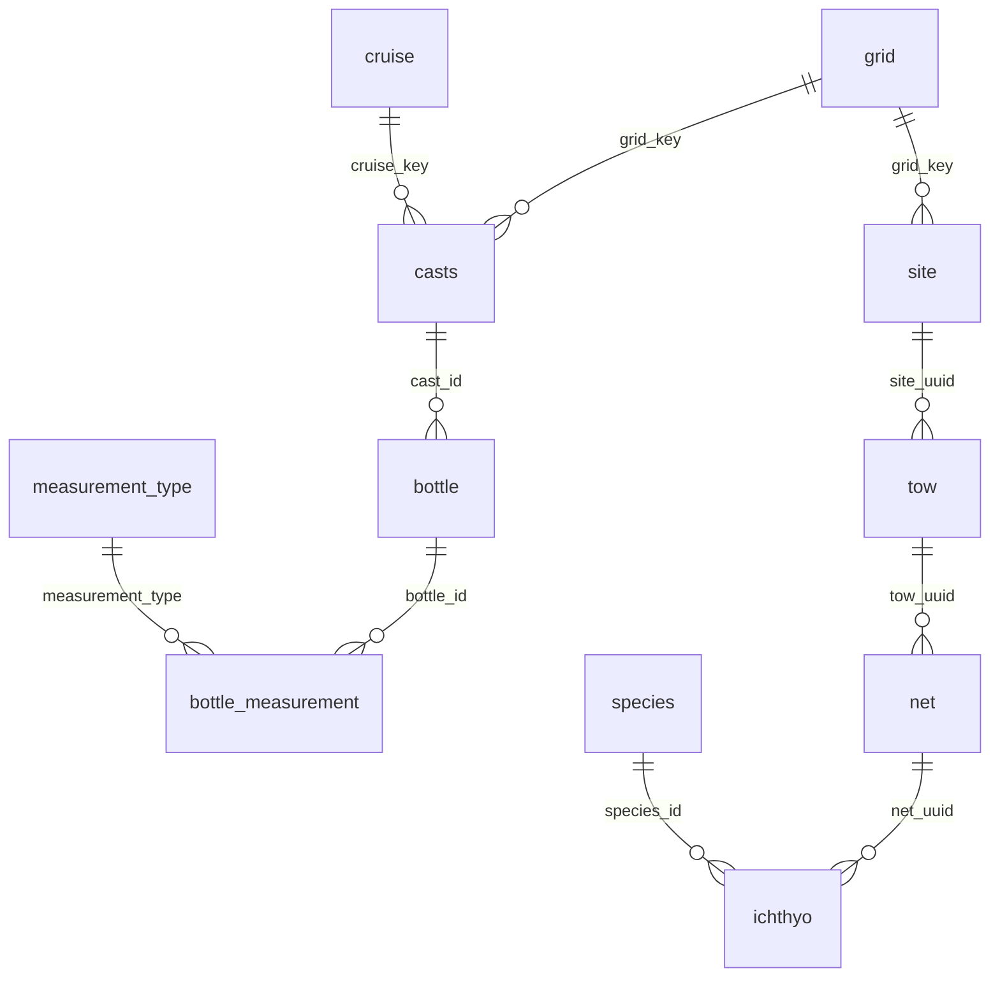
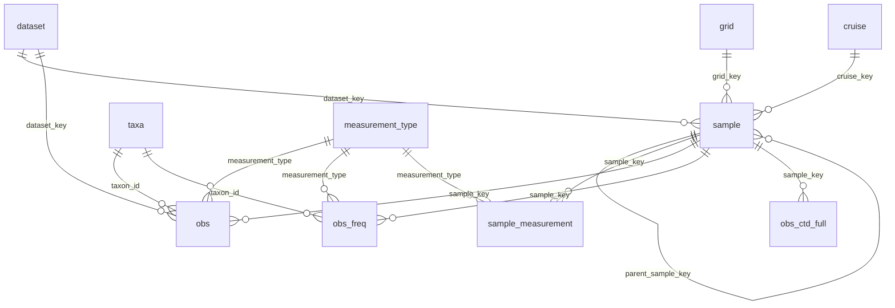

# Design: Observation Consolidation (`obs` + `sample`)

*Part C of the station-portal epic (2026-07). Companion to the `v_obs_env` /
`v_obs_bio` / `v_obs` views added to `release_database.qmd` (Part B), which are
the non-destructive Phase-1 realization of the target described here.*

*Revision (2026-07): the target is now a **single `obs`** table (not the earlier
`obs_env`/`obs_bio` split), a **unified `sample` dimension** that restores
sampling-event counting and the `site→tow→net` hierarchy, and a **three-grain
measurement model** (`sample_measurement` / `obs` / `obs_freq`) that honors the
biological structure ichthyo exposed.*

## Motivation

The integrated DB currently models observations as **per-dataset triples** —
`{ds}_sample` (position/time/FK), `{ds}_measurement` (long-format
`measurement_type`/`measurement_value`/`measurement_qual`), `{ds}_summary`
(aggregated replicates) — across ~13 datasets, plus shared references (`grid`,
`cruise`, `ship`, `measurement_type`, taxon tables). That is ~40+ tables, and
every cross-dataset consumer must know each dataset's bespoke schema and join
path. The three spatial summarizers each re-implement the same cross-dataset
union at a different grain:

- **`db-viz-hex`** (H3 hexagons) · **`db-viz-cruise`** (cruise tracks) ·
  **station portal** (station grid).

Three goals:

1. **Provenance** — stamp every observation with a single
   `dataset_key = provider_dataset` (done in Part B: `dataset` ref table +
   `dataset_key` in the views + `field_dictionary`).
2. **A common observation surface** — one `obs` table every consumer reads,
   instead of ~13 bespoke schemas.
3. **Grain fidelity** — preserve what per-dataset consumers still need: the
   ability to count **sampling events** (casts, tows, nets), reconstruct the
   `site→tow→net` hierarchy, and represent the full structure of biological
   measurements (effort, count, size/stage distributions).

## Realized non-destructively today (Phase 1)

`release_database.qmd` now builds, over the existing per-dataset tables:

- `dataset` reference (keyed by `dataset_key`), and
- `v_obs_env` / `v_obs_bio` / `v_obs` VIEWs projecting every dataset into a
  common, `dataset_key`-stamped shape.

Validated against the release parquet: env = bottle (11.0 M obs / 26 measurement
types), CTD (`ctd_measurement ⨝ ctd_cast`), DIC; bio = ichthyo (826 K obs / 759
taxa, with `life_stage`), zoodb, zooscan, cufes, euphausiids, phyllosoma,
bird_mammal. This proves the model with **zero re-ingest**. `v_obs` (the common
union) is the Phase-1 proxy for the future single `obs` table; the target below
extends it with `taxon_id` + `life_stage` + `sample_key`.

## Target model — one `obs` + a three-grain measurement family

The target is a small **core** set of tables that every consumer reads, plus a
handful of shared references. The intellectual core is that a *measurement is not
one flat long triple* — there are **three grains**, each its own core table, all
keyed off `sample_key` (and, for biology, `taxon_id` / `life_stage`) so that a
taxon-occurrence's effort, count, and size distribution stay linked by shared
keys.

### Three grains of measurement

| grain | table | holds | example |
|---|---|---|---|
| **event / effort** | `sample_measurement` | scalars about the *sampling event*; apply to all taxa in it | net `volume_sampled`, `std_haul_factor`, `prop_sorted`, plankton biomass; bottle `cast_condition` |
| **occurrence headline** | `obs` | one scalar per (sample, [taxon, life_stage], measurement_type) | env: `temperature`, `salinity`; bio: **`abundance`** (count), `biomass` |
| **sub-occurrence bin** | `obs_freq` | a (bin, count) distribution of an attribute *within* an occurrence | ichthyo length-frequency (`body_length`), stage-frequency (`stage`) |

This is what "how is `life_stage` handled when there are associated volume and
length measurements?" resolves to: `life_stage` is a column at the occurrence
grain (`obs` / `obs_freq`); **volume** is event-level (`sample_measurement`,
stored once per net — not repeated per taxon); **length** is sub-occurrence
binned detail (`obs_freq`). Ichthyo is the only dataset that populates `obs_freq`
today (its `size`/`stage` are genuine (bin, count) frequency distributions,
unique among the bio datasets), but `obs_freq` is a **core** table generalized
for future size-spectra datasets — not a dataset-specific sidecar.

### `obs` — occurrence-headline long table

One scalar per row. Env rows set `depth_min_m = depth_max_m` (a point) and leave
`taxon_id` / `life_stage` NULL; bio rows carry the taxon dimension and a depth
range.

`obs_id` PK · `realm` (`'env'`|`'bio'`) · `dataset_key`→dataset ·
**`sample_key`→sample** · `grid_key`→grid (nullable; phyto) · `cruise_key`→cruise ·
`latitude` · `longitude` · `datetime` · `depth_min_m` · `depth_max_m` ·
`taxon_id`→taxa (nullable) · `life_stage` (nullable) ·
`measurement_type`→measurement_type · `measurement_value` · `measurement_qual`
(nullable) · `measurement_prec` (nullable) · `hex_id` (computed).

> This equals today's `v_obs` common columns **plus** `taxon_id` + `life_stage` +
> `sample_key`. `grid_key` / `cruise_key` stay **denormalized** on `obs` so the
> hex / station / cruise rollups `GROUP BY` them on the big table without joining
> `sample`. Ichthyo base rows (today `measurement_type = NULL`) become an explicit
> `measurement_type = 'abundance'` with `measurement_value` = the count (`tally`);
> standardized abundance is derivable via `std_haul_factor` in
> `sample_measurement`.

### `obs_freq` — generalized (bin, count) frequency distributions

A distribution of counts over a binned attribute, *within* a taxon-occurrence.

`obs_freq_id` PK · `dataset_key`→dataset · **`sample_key`→sample** ·
`taxon_id`→taxa (nullable) · `life_stage` (nullable) ·
`measurement_type`→measurement_type (the *binned attribute*: `body_length`,
`stage`, …) · `bin_value` (DOUBLE — length in mm, or stage number) · `bin_label`
(VARCHAR, nullable — e.g. `preflexion`, via `lookup`) · `count` (INTEGER —
individuals in the bin) · `measurement_qual` (nullable).

> Ichthyo `size` → `measurement_type = 'body_length'` (`bin_value` = mm); `stage`
> → `measurement_type = 'stage'` (`bin_value` = stage number, `bin_label` from
> `lookup`). Kept lean — join `sample` for space/time. Links to its `obs`
> abundance headline and its net's `sample_measurement` by shared
> (`sample_key`, `taxon_id`, `life_stage`).

### `sample_measurement` — event / effort long table

The event-level analog of `obs`; the OBIS net-level eMoF made a first-class
table. Same tidy long triple as `obs`, minus the taxon dimension.

`sample_measurement_id` PK · **`sample_key`→sample** · `dataset_key` ·
`measurement_type`→measurement_type · `measurement_value` · `measurement_qual`
(nullable).

> Homes ichthyo net `volume_sampled` / `std_haul_factor` / `prop_sorted` /
> plankton biomass (`publish_ichthyo_to_obis.qmd` L461-517) and generalizes bottle
> `cast_condition` (already this shape). Stored once per event — do **not** put
> these on `obs` (they aren't taxon observations) or as per-dataset columns on
> `sample` (a schema leak).

### `sample` — the event dimension (adjacency-list hierarchy)

One row per physical sampling event, at its native grain. Subsumes the ~10
per-dataset event tables (`site`, `tow`, `net`, `casts`, `ctd_cast`,
`dic_sample`, `cufes_sample`, `*_tow`, `*_sample`, `bird_mammal_transect`,
`phyto_sample`) into one table, and consolidates their scattered `geom`.

`sample_key` PK (VARCHAR) · `sample_type`
(`site`/`tow`/`net`/`cast`/`bottle`/`underway`/`transect`/`region_pool`) ·
`parent_sample_key` (self-FK, nullable) · `root_sample_key` (= the
station-occupation event) · `dataset_key`→dataset · `grid_key`→grid (nullable) ·
`cruise_key`→cruise · `latitude` · `longitude` · `datetime` · `depth_min_m` ·
`depth_max_m` · `geom` (GEOMETRY — **geometry lives here, not on `obs`**).

The hierarchy is a **flat adjacency list with no attribute inheritance**: every
`sample` row carries its *own* space/time/depth; `parent_sample_key` is only a
pointer for reconstruction/counting, never a channel through which attributes
flow. That is the exact distinction the OBIS export got bitten by —
`publish_ichthyo_to_obis.qmd` (L118) collapsed `cruise → net_sample` and dropped
site/tow *"to avoid event inheritance issues with NA values in the IPT."* The
pain was inheritance, not the links; storing the links without inheritance keeps
the hierarchy available without re-introducing the problem.

Because every chain here is ≤ 3 levels (`site→tow→net`; `cast→bottle`), **leaf +
`parent_sample_key` + `root_sample_key`** covers *every* level with **zero
recursion**: for an ichthyo net, the net = the row, the tow = `parent_sample_key`,
the site = `root_sample_key`. A recursive CTE stays available as a fallback but is
never on the daily path.

Per-dataset `{ds}_sample` / `site` / `tow` / `net` / `casts` / `ctd_cast` tables
survive as **VIEWs** over `sample` filtered by `dataset_key` + `sample_type`.

**Per-dataset leaf → parent → root mapping** — `obs.sample_key` points at the
*true leaf* (the event id that is the FK on the measurement row), so the finest
grain is preserved; `root_sample_key` gives the station-occupation event for free:

| dataset | leaf `sample_key` (type) | `parent_sample_key` | `root_sample_key` |
|---|---|---|---|
| calcofi_bottle | `bottle_id` (bottle) | `cast_id` (cast) | `cast_id` |
| calcofi_ctd-cast | `cast_key` (cast) | — | self |
| calcofi_dic | `bottle_id`\* (bottle) | `cast_id` (cast) | `cast_id` |
| swfsc_ichthyo | `net_uuid` (net) | `tow_uuid` (tow) | `site_uuid` |
| swfsc_cufes | `sample_id` (underway) | — | self |
| euphausiids / phyllosoma / pic_zooplankton | `tow_id` (tow) | — | self |
| cce-lter_zoodb / zooscan | `sample_id` (tow) | — | self |
| calcofi_bird_mammal_census | `gis_key` (transect) | — | self |
| calcofi_phytoplankton | `phyto_sample_id` (region_pool) | — | self (grid_key NULL) |

\*DIC shares the bottle's physical Niskin `sample_key` where the
`cast_id`/`bottle_id` match is exact (dedups the physical event); mint a
cast-parented DIC `sample` row only for composite-key-only matches.

### `obs_ctd_full` — the supplemental deep CTD table

Identical columns to `obs`; all `realm = 'env'`,
`dataset_key = 'calcofi-ctd-cast'`; full per-scan CTD resolution (216 M rows). It
is a **separate parquet** that the remotely-viewed DuckDB does **not** attach by
default — opt-in for deep CTD work. The default `obs` carries CTD via the thinned
`ctd_thin` (~5.5 M rows) instead.

> **Overlap rule:** `ctd_thin ⊂ ctd_measurement`, so for full-resolution CTD you
> **filter CTD out of `obs` and UNION `obs_ctd_full`** — never sum both, or CTD
> double-counts.

### Shared references

`grid`, `cruise`, `ship`, `measurement_type`, **`taxa`** (unified), `dataset`.

> **Implemented (2026-07-16):** the unified taxon shipped as **three** tables, not
> one — **`taxon`** (one authoritative row per taxon, `taxon_key` = lowercase
> authority prefix `worms:<worms_id>`, or **`itis:<itis_id>` for birds/Aves**;
> explicit `worms_id`/`itis_id`/`gbif_id`/`ncbi_id`/`inat_id`, `parent_taxon_key`
> self-FK, lineage), **`dataset_taxon`** (per-dataset vocabulary → `taxon_key`
> crosswalk; `obs.taxon_key` is resolved by joining it on `(dataset_key,
> ds_taxa_code)`), and **`taxon_group`** (groupings, many `taxon_key` per group).
> `obs.taxon_id`→`obs.taxon_key`; `obs_freq`→`obs_attribute` (adds categorical
> behavior). Coarse/composite taxa (cufes eggs, phyllosoma stages, euphausiid
> family, phyto functional groups, seabird/mammal species) resolve to real
> WoRMS/ITIS ids via the reviewable `metadata/measurement_taxon.csv` +
> `metadata/taxon_override.csv`. `obs_ctd_full` is a **supplemental** table
> (hosted + catalog-flagged, excluded from the ERD/default list;
> `cc_get_db(supplemental = TRUE)` to attach). Engine: `calcofi4db/R/taxa.R`.

## Why one `obs` (and how `ctd_thin` / `obs_ctd_full` make it viable)

The earlier design split env/bio into two physical tables. The decisive argument
for the split was CTD volume (216 M rows / 16 GB) and divergent partition/serve
strategies — **not** semantics, since the `v_obs` union view already delivers a
single query surface. The revision removes the volume argument at its root:

- **Volume is removed, not ignored.** With CTD represented in the default `obs`
  by `ctd_thin` (~5.5 M rows) and the full 216 M scans offloaded to
  `obs_ctd_full`, the default `obs` is ≈ 20 M rows (bottle 11 M + ctd_thin 5.5 M
  + dic + all bio few M). One partition/sort/serve strategy fits it comfortably;
  the CTD bulk keeps its own file.
- **The residual merge cost is cheap.** Env rows carry `taxon_id` / `life_stage`
  as NULLs; under zstd/RLE that is near-free, and a `realm` discriminator +
  `WHERE realm = 'env'|'bio'` compat views (`v_obs_env` / `v_obs_bio`) retain the
  ergonomic env/bio split for consumers who want it.
- **Depth is reconciled, not special-cased.** `depth_min_m` / `depth_max_m`
  serve both realms: a point for env (`min = max`), a range for tow-integrated
  bio. This is already what the Phase-1 views do.

One `obs` is the simpler surface: every consumer reads one table, and the env/bio
distinction becomes a column filter rather than a table choice.

## Grid promotion (shared reference) — recommended refactor

`grid` is currently minted inside `ingest_swfsc_ichthyo.qmd` (`grid_to_db` chunk)
from `calcofi4r::cc_grid` + `cc_grid_ctrs`, yet 9+ datasets FK into
`grid.grid_key` (`relationships_cross.csv`). That couples a **shared reference**
to one dataset's ingest and forces ichthyo to run first. Promote it:

- Extract the build into `calcofi4db::build_grid_reference(con)` — deterministic
  from `cc_grid` (needs no dataset data).
- Add a reference-scaffold target in `_targets.R` (alongside `cruise`/`ship`)
  that every ingest depends on, **or** call `build_grid_reference()` at the top
  of `release_database.qmd` assembly.
- Ingests stop *owning* `grid`; they only `assign_grid_key()` against it.
- Non-destructive: `grid_key` values are unchanged — only *where/when* it's built
  moves.

The same pattern applies to the new `sample` dimension: a
`calcofi4db::build_sample_reference(con)` peer materializes `sample` from the
per-dataset event tables.

## Spatial keys — bake in `grid_key` **and** `hex_id`

Same question as `grid_key`, for the H3 hexagons that power `db-viz-hex` /
`api-h3t`. **Store one `hex_id` at the finest resolution any consumer needs — not
one column per resolution.** H3 is hierarchical: every fine cell has exactly one
parent at each coarser level, so coarser aggregations are a query-time function,
not stored data.

- Add `hex_id` (H3 index, a `UBIGINT` → `_id` per the key convention) to `obs`,
  computed at build time from `latitude`/`longitude` with the DuckDB **`h3`
  extension**: `h3_latlng_to_cell(lat, lng, res_max)`.
- Aggregate at **any** coarser resolution on the fly:
  `SELECT h3_cell_to_parent(hex_id, :res) AS hex, avg(measurement_value) …
   GROUP BY 1`. Parenting is an integer bit-op — cheap, no join.
- This **retires** the current `hex_h3res0…N` wide columns that `api-h3t` /
  `prep_db.R` precompute per resolution: one `hex_id` + `h3_cell_to_parent`
  replaces the whole ladder. Pick `res_max` = the finest zoom the hex app renders.
- `grid_key` stays too — it's the *station* abstraction (Voronoi cells, the
  program's sampling design); `hex_id` is the *equal-area* abstraction. They are
  complementary summarization grains over the same `latitude`/`longitude`, so the
  three apps (grid / hex / cruise-track) all read `obs` and pick their grain.

## How ingestion & querying shift

**Ingestion.** After building its per-dataset tables, each ingest projects into
the core family via `calcofi4db` helpers (peers of `finalize_ingest()`):
`build_sample_reference()` / `append_sample()`, `append_obs()`,
`append_obs_freq()`, `append_sample_measurement()`. These standardize the
projection already encoded in the Phase-1 `v_obs_*` views.

**Querying — one surface, two grains.** With `sample_key` on `obs`, the *same*
table serves both grains consumers need:

- **measurement-row grain** (db-viz-hex): `count(*)` / `avg(measurement_value)`
  over `obs`.
- **sampling-event grain** (station portal, `cruise_summary`):
  `count(DISTINCT sample_key)` (leaf events) or `count(DISTINCT root_sample_key)`
  (station occupations).

No consumer re-implements a per-dataset union. Concretely, the station portal's
`build_stations.sql` obs stream collapses to
`SELECT … FROM obs GROUP BY grid_key, dataset_key`.

### Example queries

```sql
-- how many CTD casts (event grain, not per-scan)
SELECT count(DISTINCT sample_key) FROM obs
 WHERE realm = 'env' AND dataset_key = 'calcofi-ctd-cast';

-- ichthyo: count nets / tows / sites independently — a sample_type filter, no recursion
SELECT sample_type, count(*) FROM sample
 WHERE dataset_key = 'swfsc_ichthyo' AND sample_type IN ('net','tow','site')
 GROUP BY sample_type;

-- larvae abundance per station (occurrence headline, measurement grain)
SELECT grid_key, avg(measurement_value) FROM obs
 WHERE dataset_key = 'swfsc_ichthyo' AND life_stage = 'larva' AND measurement_type = 'abundance'
 GROUP BY grid_key;

-- length-frequency of a species in a net (sub-occurrence bins) + that net's volume (effort)
SELECT bin_value AS length_mm, count FROM obs_freq
 WHERE sample_key = :net_key AND taxon_id = :sp AND measurement_type = 'body_length';
SELECT measurement_value AS vol_m3 FROM sample_measurement
 WHERE sample_key = :net_key AND measurement_type = 'volume_sampled';

-- reconstruct site -> tow -> net (2 self-joins, depth <= 3, no recursion)
SELECT n.sample_key AS net_key, t.sample_key AS tow_key, s.sample_key AS site_key,
       s.grid_key, t.datetime
FROM sample n JOIN sample t ON n.parent_sample_key = t.sample_key
              JOIN sample s ON t.parent_sample_key = s.sample_key
WHERE n.dataset_key = 'swfsc_ichthyo' AND n.sample_type = 'net';

-- station coverage: both grains from one GROUP BY
SELECT grid_key, dataset_key, count(*) AS n_obs,
       count(DISTINCT sample_key) AS n_samples, count(DISTINCT cruise_key) AS n_surveys
FROM obs GROUP BY grid_key, dataset_key;
```

`calcofi4r` read helpers expose `obs` / `obs_freq` / `sample` / `obs_ctd_full`.

## Migration path (phased, non-destructive)

1. **Phase 1 — done, plus a cheap extension.** `dataset_key` +
   `v_obs_env`/`v_obs_bio`/`v_obs` VIEWs over existing tables. The cheap next step
   is to expose `sample_key` / `sample_type` / `root_sample_key` in those views —
   every arm already `JOIN`s its event tables, so the ichthyo arm just surfaces
   `net_uuid`/`tow_uuid`/`site_uuid`, bottle `bottle_id`/`cast_id`, etc.
   (`CAST(… AS VARCHAR)` to align the UNION arms, per `build_stations.sql`). This
   lets the station portal replace its hand-rolled union with `… FROM v_obs` and
   compute `count(DISTINCT sample_key)` / `count(DISTINCT root_sample_key)`
   immediately — event-counting on the consolidated surface with zero re-ingest.
2. **Phase 2.** Promote `grid` (`build_grid_reference()`); unify taxon tables →
   `taxa`; add `build_sample_reference()`. Materialize the core fact family —
   `sample`, `obs`, `obs_freq`, `sample_measurement` (each `CREATE TABLE AS SELECT`
   over the per-dataset tables / `sample_key`-bearing views) — plus the
   supplemental `obs_ctd_full`. Validate parity (see Verification).
3. **Phase 3.** Cut each ingest over to write the core tables directly
   (`append_*` helpers); per-dataset event/measurement tables + `cast_condition` +
   ichthyo `size`/`stage` become VIEWs over `sample` / `obs` / `sample_measurement`
   / `obs_freq`.
4. **Phase 4.** Repoint the three apps + `calcofi4r`. `build_stations.sql` →
   `GROUP BY grid_key, dataset_key` over `obs`; `cruise_summary`
   (`release_database.qmd` L519-565) → `count(DISTINCT root_sample_key)` per
   cruise×dataset (one query replacing its four per-dataset
   `COUNT(DISTINCT site_key)` subqueries); db-viz-hex unaffected (still
   `COUNT(*)`/`avg` over `obs`).

## Edge cases / decisions

- **Region-pooled phytoplankton** has NO `grid_key` (cruise×region grain). Its
  `sample` rows carry `sample_type = 'region_pool'` and `grid_key` NULL; `obs`
  rows carry `grid_key` NULL (add a nullable `region_key`→region if a region join
  is needed). Intentionally excluded from the grid-keyed Phase-1 views.
- **Euphausiids** lack per-species resolution in the DB (only total
  `euphausiid_abundance`) → `obs.taxon_id` NULL until re-ingested with species.
- **Taxon baked into `measurement_type`** (cufes eggs-by-species, phyllosoma
  stages, bird_mammal): `obs.taxon_id` NULL, the taxon encoded in the type name.
  Their tows/transects still count via `sample_key`.
- **Datasets carrying both env + catch** (e.g. cufes records surface T/S): route
  environmental readings to `obs` `realm='env'`, catch to `realm='bio'`, both
  sharing the underway `sample_key`.
- **`_qual` / `_prec`**: carry `measurement_qual` (+ `measurement_prec` for
  bottle) into `obs`; bio rarely has qual.
- **Geometry**: `geom` lives on `sample` (and shared refs like `grid`), NOT on
  `obs` / `obs_freq` — avoids per-measurement geometry bloat and the known CRS
  `UPDATE`/`CREATE INDEX` bug. `obs` carries `latitude`/`longitude` doubles; join
  `sample`/`grid` for polygons.
- **CTD volume**: handled by `obs` (via `ctd_thin`) + `obs_ctd_full` (full scans,
  supplemental, opt-in) — see the overlap rule above.

## Before / after ERD

**Before** — per-dataset triples, each with its own join path to the shared refs
(example datasets: bottle = env, ichthyo = bio):



**After** — one `sample` dimension + the three-grain measurement family + shared
refs; every dataset lands the same way:



(`hex_id` is a computed column on `obs`; `obs_ctd_full` is the supplemental
full-resolution CTD table with the same schema as `obs`; `grid`/`cruise` stay
denormalized on `obs` for rollups; the per-dataset `{ds}_sample`/`_measurement`
remain as detail VIEWs, not shown.)

## `measurement_type` vocabulary changes

- Ichthyo `size` → **`body_length`** (the binned attribute in `obs_freq`).
- Ichthyo `stage` stays `stage` (binned attribute in `obs_freq`, labeled via
  `lookup`).
- Drop the `tally`-as-a-type registry entry: ichthyo base rows become
  `measurement_type = 'abundance'` in `obs` (the count is the value).
- Add event-level types used by `sample_measurement`: `volume_sampled`,
  `std_haul_factor`, `prop_sorted`, `small_plankton_biomass`,
  `total_plankton_biomass`.

## Impact on table count & size

- **Table count: ~40–50 → ~10 core.** Today ≈ 13 datasets × (sample + measurement
  + summary) + per-dataset taxon/lookup/event tables + shared refs. After: four
  core fact/dimension tables (`obs`, `obs_freq`, `sample`, `sample_measurement`)
  + six shared refs (`dataset`, `grid`, `cruise`, `ship`, `measurement_type`,
  `taxa`), plus the supplemental `obs_ctd_full` — a ~4–5× reduction. Critically,
  `sample` *replaces* the ~10 per-dataset event tables (and consolidates their
  scattered `geom`) rather than adding to them; per-dataset detail survives only
  as VIEWs.
- **Row count: unchanged** (same observations). Default `obs` ≈ 20 M rows
  (bottle 11 M + ctd_thin 5.5 M + dic + bio few M); `obs_ctd_full` ≈ 216 M rows;
  `sample` is small (low single-digit M — one row per physical event, *not* per
  scan); `obs_freq` is a small ichthyo-only table today.
- **Storage: modestly smaller, plus a big serving win.** `{ds}_summary` tables
  become VIEWs (drop their bytes); N per-dataset taxon tables merge into one
  `taxa`; homogeneous sorted long columns compress better under zstd; the 216 M
  CTD bulk leaves the default DB entirely (opt-in `obs_ctd_full`). The headline
  win is **schema simplicity + one query surface + a lean default DB**.

## Parquet partitioning, sorting & ERDDAP serving

Grounded in `bench_erddap_ctd.qmd` (216 M-row CTD benchmark on a 2 GB ERDDAP heap):

- **Granularity, not format, is the memory lever.** A single 935 MB
  `ctd_wide.parquet` OOM'd a 4 GB heap; the fix was **Hive-partition by
  `cruise_key`** (96 files) served as one aggregated ERDDAP dataset, which ERDDAP
  prunes by `cruise_key`. → Partition the default `obs` **by `dataset_key`**
  (its natural fan-out; env and bio coexist), and partition the big
  `obs_ctd_full` **by `cruise_key`**.
- **Sort within each partition** for compression + predicate pushdown:
  `obs` by `(grid_key, depth_min_m, measurement_type)`; `obs_ctd_full` by
  `(grid_key, depth_min_m, measurement_type)`. For spatial-range/hex workloads,
  order by a space-filling curve on `hex_id` (H3 ordering) or `ST_Hilbert(geom)` —
  the repo already prefers `ST_Hilbert()`.
- **Compression** zstd (repo default); moderate row groups (~100 K–1 M rows) so
  ERDDAP/DuckDB push predicates down without reading whole groups.
- **ERDDAP serving:** the big `obs_ctd_full` uses **DuckDB
  `EDDTableFromDatabase`** — via JDBC it *streams* a filtered `ResultSet`
  (predicate pushdown + partition pruning + disk spill), staying ~65 MB heap for
  *any* size, vs file backends that load whole files. Serve `datetime` as a real
  **`TIMESTAMP`** in the view (epoch-double NPEs the DuckDB JDBC driver). The
  smaller default `obs` can be `EDDTableFromParquetFiles` over the partitioned
  files or DuckDB. Keep `ctd_thin` (inside `obs`) as the interactive headline;
  `obs_ctd_full` stays the supplemental deep dataset.
- **Apps:** `db-viz-hex` reads `obs` + `h3_cell_to_parent(hex_id, res)` (drops
  the precomputed per-res tables); the station portal's build becomes
  `… FROM obs GROUP BY grid_key, dataset_key`; `db-viz-cruise` groups by
  `cruise_key`. One partitioned/sorted source, three grains.

## Verification (when materialized)

- **Sample-count parity** (per level): `count(sample WHERE sample_type='net')
  == count(DISTINCT net.net_uuid)`, and likewise for `tow`/`site`/`cast`/`bottle`.
- **`obs` row-count parity**: `obs` count == Σ per-dataset headline measurement
  counts (CTD counted via `ctd_thin`, not `ctd_measurement`); `obs_ctd_full`
  count == `ctd_measurement`.
- **`obs_freq` sum-of-bins parity**: per occurrence (`sample_key`, `taxon_id`,
  `life_stage`), `SUM(count)` over `stage` bins == the `abundance` total in `obs`;
  over `body_length` bins ≤ the total (length is a measured subsample).
- **Every row has a valid** `dataset_key` (FK `dataset`), `grid_key` (FK `grid`,
  or NULL for phyto), `measurement_type` (FK `measurement_type`), and
  `sample_key` (FK `sample`).
- **Consumer parity**: the three apps produce identical summaries reading `obs` vs
  their current per-dataset unions; `obs` event-count queries reproduce
  `build_stations.sql`'s `n_samples` / `n_surveys`.
