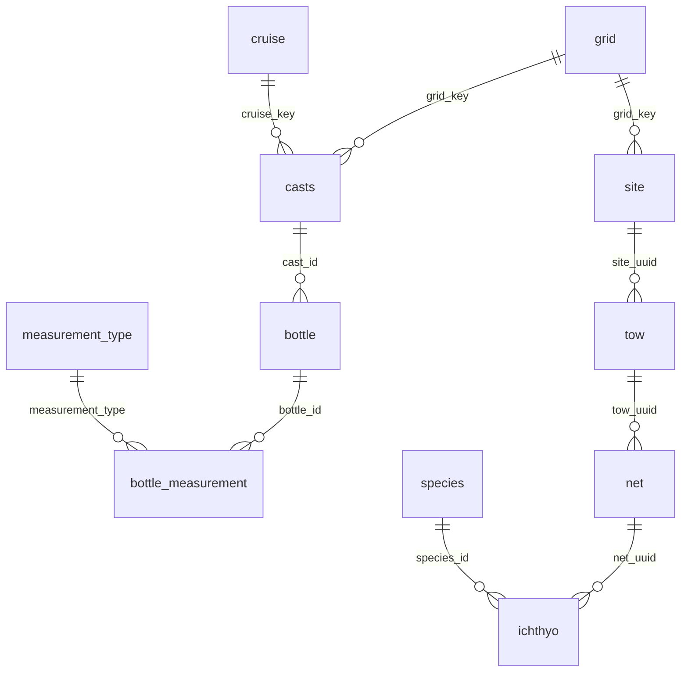
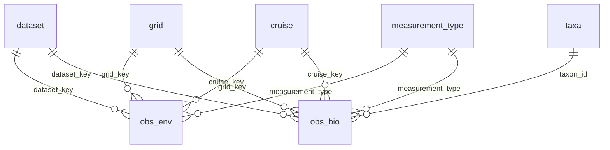

# Design: Env/Bio Observation Consolidation

*Part C of the station-portal epic (2026-07). Companion to the `v_obs_env` /
`v_obs_bio` / `v_obs` views added to `release_database.qmd` (Part B), which are
the non-destructive Phase-1 realization of the target described here.*

## Motivation

The integrated DB currently models observations as **per-dataset triples** —
`{ds}_sample` (position/time/FK), `{ds}_measurement` (long-format
`measurement_type`/`measurement_value`/`measurement_qual`), `{ds}_summary`
(aggregated replicates) — across ~13 datasets, plus shared references (`grid`,
`cruise`, `ship`, `measurement_type`, taxon tables). That is ~40+ tables, and
every cross-dataset consumer must know each dataset's bespoke schema and join
path. The three spatial summarizers each re-implement the same cross-dataset
union at a different grain:

- **`db-viz-hex`** (H3 hexagons) · **`db-viz-cruise`** (cruise tracks) ·
  **station portal** (station grid).

Two goals:

1. **Provenance** — stamp every observation with a single
   `dataset_key = provider_dataset` (done in Part B: `dataset` ref table +
   `dataset_key` in the views + `field_dictionary`).
2. **A common observation surface** that honors the two fundamentally different
   observation grains: **environment** (physical/chemical, depth *profile*) vs
   **biology** (taxon, tow-*integrated* depth).

## Realized non-destructively today (Phase 1)

`release_database.qmd` now builds, over the existing per-dataset tables:

- `dataset` reference (keyed by `dataset_key`), and
- `v_obs_env` / `v_obs_bio` / `v_obs` VIEWs projecting every dataset into a
  common, `dataset_key`-stamped shape.

Validated against the release parquet: env = bottle (11.0 M obs / 26 measurement
types), CTD (`ctd_measurement ⨝ ctd_cast`), DIC; bio = ichthyo (826 K obs / 759
taxa, with `life_stage`), zoodb, zooscan, cufes, euphausiids, phyllosoma,
bird_mammal. This proves the model with **zero re-ingest**.

## Target model — two consolidated long tables

### `obs_env` (physical / chemical — point depth)
`obs_env_id` PK · `dataset_key`→dataset · `grid_key`→grid · `cruise_key`→cruise ·
`cast_key` · `latitude` · `longitude` · `datetime` · **`depth_m` (point)** ·
`measurement_type`→measurement_type · `measurement_value` · `measurement_qual` ·
`measurement_prec`. Sources: **bottle, ctd-cast, dic**. Grain: one row per
(cast/scan, depth, measurement_type) — a vertical profile.

### `obs_bio` (species / biology — tow-integrated depth)
`obs_bio_id` PK · `dataset_key` · `grid_key` · `cruise_key` · `sample_key` ·
`latitude` · `longitude` · `datetime` · **`depth_min_m` / `depth_max_m` (range)** ·
`taxon_id`→taxa · `life_stage` · `measurement_type` (abundance/biomass/tally/count) ·
`measurement_value` · `measurement_qual`. Sources: **ichthyo, cufes, euphausiids,
zooplankton, zooscan, zoodb, phyllosoma, bird_mammal, phytoplankton**. Grain: one
row per (sample, taxon, measurement_type).

### Shared references
`grid`, `cruise`, `ship`, `measurement_type`, **`taxa`** (unified), `dataset`.

### Why split env/bio (not one table)
- **Depth semantics differ**: env is a point on a profile (`depth_m`); bio is an
  integrated tow range (`depth_min_m`/`depth_max_m`). One table would need both +
  a discriminator.
- **Taxon dimension** is central to bio, absent for env → a single table carries a
  mostly-null `taxon_id`.
- **Vocabulary differs**: env `measurement_type` is physical/chemical canonical
  quantities; bio is abundance/biomass/tally/count *per taxon*.
- **Query patterns differ**: env → profiles & time-series at station×depth; bio →
  community composition at station×taxon.
- Consumers who want both still get `v_obs` (the common columns).

## How ingestion shifts

- Each ingest, after building its per-dataset tables, **projects into
  `obs_env`/`obs_bio`** with `dataset_key` + `grid_key` — using exactly the
  per-dataset mapping already encoded in `v_obs_*`. Add `calcofi4db` helpers
  `append_obs_env()` / `append_obs_bio()` that standardize this projection (peers
  of `finalize_ingest()`).
- `{ds}_sample` / `{ds}_measurement` remain dataset-specific **detail** (or become
  VIEWs over `obs_*`); `{ds}_summary` becomes a VIEW over `obs_*`
  (`AVG` + `STDDEV_SAMP`, the existing summary pattern).
- **Unify taxon tables** (`species`, `zoodb_taxon`, `zooscan_taxon`,
  `phyto_taxon`, …) into one `taxa` keyed by `aphia_id` (with `_source` columns)
  so `obs_bio.taxon_id`→`taxa`.

## Grid promotion (shared reference) — recommended refactor

`grid` is currently minted inside `ingest_swfsc_ichthyo.qmd` (`grid_to_db` chunk)
from `calcofi4r::cc_grid` + `cc_grid_ctrs`, yet 9+ datasets FK into
`grid.grid_key` (`relationships_cross.csv`). That couples a **shared reference**
to one dataset's ingest and forces ichthyo to run first. Promote it:

- Extract the build into `calcofi4db::build_grid_reference(con)` — deterministic
  from `cc_grid` (needs no dataset data).
- Add a reference-scaffold target in `_targets.R` (alongside `cruise`/`ship`)
  that every ingest depends on, **or** call `build_grid_reference()` at the top
  of `release_database.qmd` assembly.
- Ingests stop *owning* `grid`; they only `assign_grid_key()` against it.
- Non-destructive: `grid_key` values are unchanged — only *where/when* it's built
  moves.

## How querying shifts

- Cross-dataset coverage/joins live in **one place** (`obs_env`/`obs_bio`) keyed
  by `grid_key` / `cruise_key` / `measurement_type` / `taxon_id`.
- All three spatial summarizers read `obs_*` instead of re-implementing per-dataset
  unions. Concretely, the station portal's `build_stations.sql` obs stream
  collapses to `SELECT … FROM v_obs GROUP BY grid_key, dataset_key`.
- `calcofi4r` read helpers expose `obs_env` / `obs_bio` / `v_obs`.

## Migration path (phased, non-destructive)

1. **Phase 1 — done.** `dataset_key` + `v_obs_env`/`v_obs_bio`/`v_obs` VIEWs over
   existing tables. Consumers can adopt now.
2. **Phase 2.** Promote `grid`; unify `taxa`; add `append_obs_*` helpers; backfill
   physical `obs_env`/`obs_bio` (`CREATE TABLE AS SELECT * FROM v_obs_*`);
   validate row-count parity vs per-dataset tables.
3. **Phase 3.** Cut each ingest over to write `obs_env`/`obs_bio` directly; keep
   `{ds}_sample`/`_measurement` as detail or VIEWs.
4. **Phase 4.** Repoint the three apps + `calcofi4r` to `obs_*`; deprecate
   redundant per-dataset summary tables.

## Edge cases / decisions

- **Region-pooled phytoplankton** has NO `grid_key` (cruise×region grain).
  Recommend adding a nullable `grid_key` + `region_key`→region to `obs_bio`
  (phyto rows carry `grid_key` NULL). It is intentionally excluded from the
  grid-keyed Phase-1 views.
- **Euphausiids** lack per-species resolution in the DB (only total
  `euphausiid_abundance`) → `obs_bio.taxon_id` NULL until re-ingested with species.
- **Datasets carrying both env + catch** (e.g. cufes records surface T/S): route
  environmental readings to `obs_env`, catch to `obs_bio`, linked by `sample_key`.
- **`_qual` / `_prec`**: carry `measurement_qual` (+ `measurement_prec` for
  bottle) into `obs_env`; bio rarely has qual.
- **Geometry**: keep `geom` on sample/reference tables (`grid`, `casts`, tows),
  NOT on the `obs_*` long tables — avoids per-measurement geometry bloat and the
  known CRS `UPDATE`/`CREATE INDEX` bug. `obs_*` carry `latitude`/`longitude`
  doubles; join `grid` for polygons.
- **CTD volume**: `obs_env` over `ctd_measurement` is ~15 GB. Keep it a VIEW
  (lazy), or materialize `obs_env` from the thinned `ctd_thin` for interactive use
  and leave full `ctd_measurement` supplemental.

## Spatial keys — bake in `grid_key` **and** `hex_id`

Same question as `grid_key`, for the H3 hexagons that power `db-viz-hex` /
`api-h3t`. **Store one `hex_id` at the finest resolution any consumer needs — not
one column per resolution.** H3 is hierarchical: every fine cell has exactly one
parent at each coarser level, so coarser aggregations are a query-time function,
not stored data.

- Add `hex_id` (H3 index, a `UBIGINT` → `_id` per the key convention) to `obs_env`
  / `obs_bio`, computed at build time from `latitude`/`longitude` with the DuckDB
  **`h3` extension**: `h3_latlng_to_cell(lat, lng, res_max)`.
- Aggregate at **any** coarser resolution on the fly:
  `SELECT h3_cell_to_parent(hex_id, :res) AS hex, avg(measurement_value) …
   GROUP BY 1`. Parenting is an integer bit-op — cheap, no join.
- This **retires** the current `hex_h3res0…N` wide columns that `api-h3t` /
  `prep_db.R` precompute per resolution: one `hex_id` + `h3_cell_to_parent`
  replaces the whole ladder. Pick `res_max` = the finest zoom the hex app renders
  (it bounds the achievable detail; everything coarser is derivable).
- `grid_key` stays too — it's the *station* abstraction (Voronoi cells, the
  program's sampling design); `hex_id` is the *equal-area* abstraction. They are
  complementary summarization grains over the same `latitude`/`longitude`, so the
  three apps (grid / hex / cruise-track) all read `obs_*` and pick their grain.

## Before / after ERD (example datasets: bottle = env, ichthyo = bio)

**Before** — per-dataset triples, each with its own join path to the shared refs:

**After** — two long tables + shared refs; every dataset lands the same way:

(`hex_id` is a computed column on `obs_env`/`obs_bio`, not a table; the
per-dataset `{ds}_sample`/`_measurement` remain as detail/VIEWs, not shown.)

## Impact on table count & size

- **Table count: ~40–50 → ~8 core.** Today ≈ 13 datasets × (sample + measurement
  + summary) + per-dataset taxon/lookup tables + shared refs. After: `obs_env`,
  `obs_bio`, and six shared refs (`dataset`, `grid`, `cruise`, `ship`,
  `measurement_type`, `taxa`) — a ~5× reduction. Per-dataset detail survives only
  where genuinely dataset-specific, ideally as VIEWs.
- **Row count: unchanged** (same observations). `obs_env` ≈ Σ env measurement rows
  — dominated by `ctd_measurement` (**216 M rows / ~16 GB**); `obs_bio` is a few M
  rows. Consolidation does not add rows.
- **Storage: modestly smaller, not dramatically.** The `ctd_measurement` bulk is
  unchanged, but (a) the `{ds}_summary` tables become VIEWs (drop their stored
  bytes), (b) merging N per-dataset taxon tables into one `taxa` removes
  duplication, and (c) homogeneous, sorted long columns compress better under
  zstd than N heterogeneous schemas. The win is **schema simplicity + one query
  surface**, not a big byte reduction (the CTD long table dominates either way).

## Parquet partitioning, sorting & ERDDAP serving

Grounded in `bench_erddap_ctd.qmd` (216 M-row CTD benchmark on a 2 GB ERDDAP heap):

- **Granularity, not format, is the memory lever.** A single 935 MB
  `ctd_wide.parquet` OOM'd a 4 GB heap; the fix was **Hive-partition by
  `cruise_key`** (96 files) served as one aggregated ERDDAP dataset, which ERDDAP
  prunes by `cruise_key`. → Partition `obs_env` **by `cruise_key`** (or
  `dataset_key`/`year(datetime)` for a coarser fan-out); partition the much
  smaller `obs_bio` **by `dataset_key`**.
- **Sort within each partition** for compression + predicate pushdown:
  `obs_env` by `(grid_key, depth_m, measurement_type)`; `obs_bio` by
  `(grid_key, taxon_id)`. For spatial-range/hex workloads, order by a space-filling
  curve on `hex_id` (H3 ordering) or `ST_Hilbert(geom)` — the repo already prefers
  `ST_Hilbert()`.
- **Compression** zstd (repo default); moderate row groups (~100 K–1 M rows) so
  ERDDAP/DuckDB push predicates down without reading whole groups.
- **ERDDAP serving:** for the big `obs_env` (CTD-dominated), use **DuckDB
  `EDDTableFromDatabase`** — via JDBC it *streams* a filtered `ResultSet`
  (predicate pushdown + partition pruning + disk spill), staying ~65 MB heap for
  *any* size, vs file backends that load whole files. Serve `datetime` as a real
  **`TIMESTAMP`** in the view (epoch-double NPEs the DuckDB JDBC driver). The
  smaller `obs_bio` can be `EDDTableFromParquetFiles` over the partitioned files or
  DuckDB. Keep `ctd_thin` as the interactive headline; full `obs_env` stays the
  supplemental deep dataset.
- **Apps:** `db-viz-hex` reads `obs_*` + `h3_cell_to_parent(hex_id, res)` (drops
  the precomputed per-res tables); the station portal's build becomes
  `… FROM v_obs GROUP BY grid_key, dataset_key`; `db-viz-cruise` groups by
  `cruise_key`. One partitioned/sorted source, three grains.

## Verification (when materialized)

- **Row-count parity**: `obs_env` count == Σ per-dataset env measurement counts;
  same for `obs_bio`.
- Every row has a valid `dataset_key` (FK `dataset`), `grid_key` (FK `grid`, or
  NULL for phyto), `measurement_type` (FK `measurement_type`).
- The three apps produce identical summaries reading `obs_*` vs their current
  per-dataset unions.
